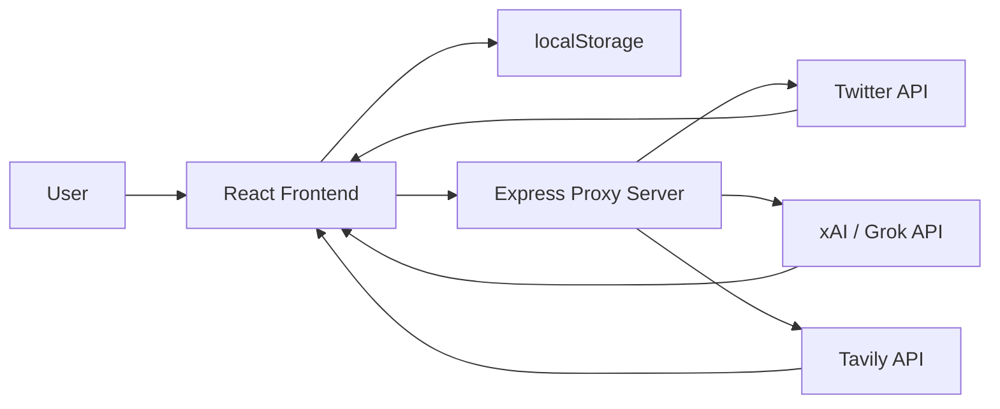
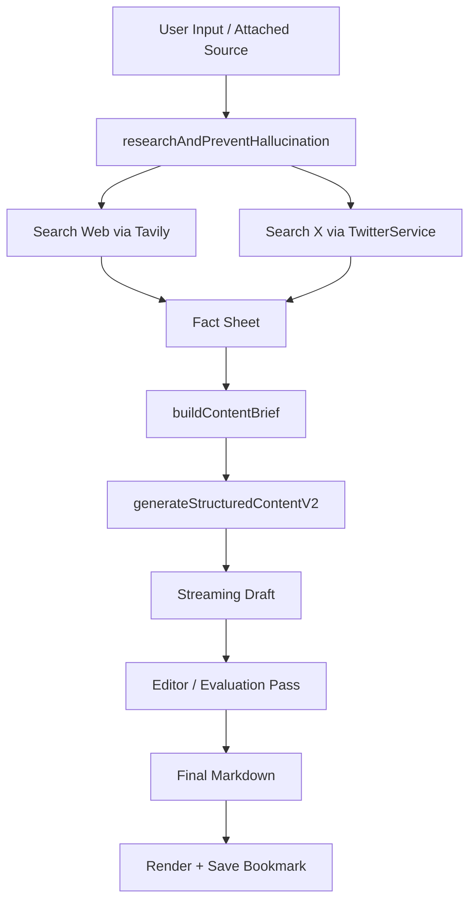

# เอกสารสถาปัตยกรรมระบบ Foro

## วัตถุประสงค์

เอกสารนี้อธิบายภาพรวมสถาปัตยกรรมของระบบ Foro ในมุมมองของทีมพัฒนา โดยเน้นว่าแต่ละฟีเจอร์ทำงานอย่างไร ข้อมูลไหลผ่านส่วนใดบ้าง และแต่ละ module รับผิดชอบอะไร

ระบบนี้เป็น Web Application แบบ React + Vite ที่มี Express เป็น proxy server สำหรับเชื่อมต่อกับบริการภายนอก ได้แก่

- Twitter API สำหรับดึงข้อมูลจาก X
- xAI / Grok สำหรับสรุปข่าว คัดกรอง และสร้างคอนเทนต์
- Tavily สำหรับค้นคว้าข้อมูลบนเว็บเพื่อช่วยลด hallucination

## ภาพรวมระบบ

## Technology Stack

- Frontend: React 19 + Vite
- UI: React component แบบ stateful เป็นหลัก
- AI SDK: `ai` + `@ai-sdk/xai`
- Backend gateway: Express + `http-proxy-middleware`
- Markdown rendering: `marked` + `DOMPurify`
- Persistence ฝั่ง client: `localStorage`

## โครงสร้างโมดูลหลัก

### 1. Frontend Shell

Frontend boot จาก `src/main.jsx` แล้ว render `src/App.jsx` เป็น root ของทั้งระบบ

`App.jsx` ทำหน้าที่เป็นทั้ง:

- state container กลางของแอป
- orchestration layer สำหรับแต่ละ feature
- controller ที่เชื่อม UI กับ service layer

### 2. UI Components

component สำคัญมีดังนี้

- `src/components/Sidebar.jsx`: เมนูเปลี่ยนมุมมองหลักของระบบ
- `src/components/RightSidebar.jsx`: จัดการ Post List, สมาชิกใน list, การแชร์ และการปรับแต่ง list
- `src/components/FeedCard.jsx`: การ์ดแสดงโพสต์ข่าวแต่ละรายการ พร้อม action เช่น bookmark และสร้างคอนเทนต์
- `src/components/CreateContent.jsx`: หน้าสร้างคอนเทนต์ด้วย AI พร้อม workflow research -> generate -> review

### 3. Service Layer

- `src/services/TwitterService.js`: ติดต่อ API สำหรับ user info, feed, search และ thread
- `src/services/GrokService.js`: รวม logic ด้าน AI ทั้งการสรุปข่าว, คัดกรอง, research, fact sheet และสร้างคอนเทนต์
- `src/utils/markdown.js`: แปลง markdown เป็น HTML และ sanitize ก่อนแสดงผล

### 4. Proxy Layer

`server.cjs` ทำหน้าที่เป็น backend บาง ๆ เพื่อ:

- ซ่อน API key ไม่ให้ถูกเรียกตรงจาก browser
- route request ไปยัง upstream API
- เป็นจุดรวม integration กับ external services

## หลักการออกแบบของระบบ

ระบบนี้ไม่ได้แยก state management library ออกมาต่างหาก เช่น Redux หรือ Zustand แต่ใช้ `useState` และ `useEffect` ภายใน `App.jsx` เป็นหลัก ทำให้ architecture ปัจจุบันมีลักษณะเป็น:

- UI-driven state orchestration
- service-oriented business logic
- client-side persistence
- server-side proxy integration

ข้อดีคือพัฒนาเร็วและ flow เข้าใจง่ายในโปรเจกต์ขนาดกลาง แต่ trade-off คือ `App.jsx` รับผิดชอบหลายเรื่องและเริ่มมีความซับซ้อนสูง

## Feature Architecture

## 1. Home Feed

### เป้าหมาย

ดึงโพสต์ล่าสุดจากบัญชีที่ผู้ใช้ติดตาม แล้วแสดงใน feed พร้อมแปล/สรุปเป็นภาษาไทยแบบ progressive

### ข้อมูลที่ใช้

- `watchlist`: รายชื่อ account ที่ติดตาม
- `postLists`: กลุ่มย่อยของ account
- `originalFeed`: ข้อมูลต้นฉบับของ feed
- `feed`: feed ที่ผ่านการ filter แล้วเพื่อใช้แสดงผล

### flow การทำงาน

1. ผู้ใช้กด sync feed
2. `App.jsx` เรียก `fetchWatchlistFeed(...)`
3. `TwitterService` สร้าง query แบบ `from:user1 OR from:user2 ...`
4. request ถูกส่งผ่าน `/api/twitter/...`
5. backend proxy ส่งต่อไปยัง Twitter API
6. ข้อมูลถูก normalize ให้ shape สม่ำเสมอ
7. frontend sort ตามเวลาใหม่ไปเก่า
8. ระบบแบ่งข้อมูลเป็น chunk ละ 10 รายการ
9. รายการที่ยังไม่มี summary ภาษาไทยจะถูกส่งไป `generateGrokBatch(...)`
10. เมื่อได้ summary กลับมา จะ merge เข้ากับ `originalFeed`
11. `feed` ถูก derive อีกชั้นตาม active view หรือ active list

### ประเด็นทางสถาปัตยกรรม

- ใช้ `originalFeed` เป็น source of truth
- ใช้ `feed` เป็น derived state สำหรับ UI
- แปล/สรุปแบบ chunked progressive update เพื่อให้ผู้ใช้เห็นผลเร็ว ไม่ต้องรอทั้งหมด
- มี sanitize layer เพื่อกันข้อมูลเก่าที่ summary ไม่สมบูรณ์

## 2. Search

### เป้าหมาย

ค้นหาโพสต์จาก X ตาม keyword แล้วให้ AI ช่วยยกระดับผลลัพธ์ก่อนแสดง

### flow การทำงาน

1. ผู้ใช้กรอกคำค้น
2. `handleSearch()` เรียก `expandSearchQuery(...)` เพื่อให้ AI ช่วยขยาย query
3. frontend เรียก `searchEverything(...)`
4. `TwitterService` ส่ง query ไปที่ Twitter search endpoint
5. เมื่อได้ผลลัพธ์กลับมา `agentFilterFeed(...)` จะคัดโพสต์คุณภาพสูง
6. `generateExecutiveSummary(...)` สร้าง executive summary ของผลค้นหา
7. แต่ละโพสต์ที่ยังไม่มี summary ภาษาไทยจะถูกส่งไป `generateGrokBatch(...)`
8. UI อัปเดตผลค้นหาและ summary แบบ progressive

### สถาปัตยกรรมของ feature นี้

- Search ไม่ใช่แค่ API search ตรง ๆ แต่เป็น AI-assisted retrieval pipeline
- มี 3 ชั้นหลักคือ query expansion, result filtering, executive summarization
- `searchResults` ใช้เก็บผลลัพธ์ที่กำลังแสดง
- `originalSearchResults` ใช้เก็บ snapshot ก่อน sort/filter เพื่อ revert กลับได้

## 3. AI Filter บน Feed

### เป้าหมาย

ให้ผู้ใช้กรอง feed ตามเงื่อนไขเชิงความหมาย เช่น ข่าว AI, ข่าวการเมือง หรือประเด็นเฉพาะทาง

### flow การทำงาน

1. ผู้ใช้กรอก prompt ใน filter modal
2. `handleAiFilter()` เรียก `agentFilterFeed(feed, prompt)`
3. AI คืนรายการ `id` ของโพสต์ที่ตรงเงื่อนไข
4. frontend filter `feed` ให้เหลือเฉพาะรายการที่ผ่าน
5. ระบบแสดงผลสรุปจำนวนรายการที่คัดได้

### หลักคิด

- ใช้ AI เป็น semantic filter แทน keyword filter แบบธรรมดา
- ไม่แก้ `originalFeed` โดยตรง ทำให้ยังมีต้นฉบับสำหรับย้อนกลับหรือ derive view อื่นได้

## 4. Audience Discovery

### เป้าหมาย

ช่วยค้นหา account ที่ควรติดตาม ทั้งแบบ AI recommendation และ manual search

### โหมดการทำงาน

- AI mode: หา expert ตามหัวข้อ
- Manual mode: ค้นหาชื่อบัญชีโดยตรง

### AI mode flow

1. ผู้ใช้ระบุหัวข้อ เช่น AI, การลงทุน, การเมือง
2. `handleAiSearchAudience()` เรียก `discoverTopExperts(query, exclude)`
3. AI คืนรายชื่อ expert ที่เหมาะสม
4. frontend แสดง card ของแต่ละ expert
5. เมื่อผู้ใช้กดเพิ่ม ระบบเรียก `getUserInfo(username)` เพื่อ verify และ hydrate ข้อมูลจริงก่อนเพิ่มเข้า watchlist

### ประเด็นทางสถาปัตยกรรม

- AI ให้ candidate list
- Twitter API เป็นแหล่ง verify ตัวตนจริง
- frontend ป้องกัน duplicate ก่อนเพิ่มเข้าระบบ

## 5. Post List Management

### เป้าหมาย

จัดกลุ่ม account ที่ติดตามให้เป็น list ตามหัวข้อ เช่น Crypto, Politics, AI

### องค์ประกอบ

- list metadata: id, name, color
- member list: usernames
- activeListId: list ที่ผู้ใช้กำลังดู

### flow การทำงาน

1. ผู้ใช้สร้างหรือ import list
2. `RightSidebar` แสดง list ทั้งหมด
3. เมื่อเลือก list ระบบจะ filter `originalFeed` เฉพาะโพสต์จากสมาชิกใน list
4. ผู้ใช้สามารถเพิ่ม/ลบสมาชิก เปลี่ยนชื่อ เปลี่ยนสี หรือ share list ได้

### หลักคิดเชิง architecture

- list เป็น logical grouping layer บน watchlist เดิม
- ไม่ได้สร้าง feed ใหม่จากฐานข้อมูลแยก แต่ใช้ filter บน in-memory state
- ทำให้เปลี่ยน view ได้เร็วโดยไม่ต้อง request ใหม่ทุกครั้ง

## 6. Read Archive

### เป้าหมาย

เก็บข่าวหรือโพสต์ที่ดึงเข้าระบบแล้วไว้ในคลังอ่านย้อนหลัง

### การทำงาน

- feed ใหม่ที่ sync มา จะถูก append เข้า `readArchive`
- ผู้ใช้สามารถ sort ตาม view หรือ engagement ได้
- ใช้ `FeedCard` ซ้ำกับหน้าอื่นเพื่อให้ interaction คงรูปแบบเดียวกัน

### ประเด็นสำคัญ

- read archive เป็น client-side archive
- ไม่มี database จริงในเวอร์ชันนี้
- persistence พึ่งพา `localStorage`

## 7. Bookmarks

### เป้าหมาย

เก็บทั้งข่าวและบทความที่สร้างแล้วไว้ในคลังส่วนตัว

### ประเภทข้อมูล

- news bookmarks: โพสต์จาก feed/search/read
- article bookmarks: เนื้อหาที่ AI สร้างขึ้น

### การทำงาน

1. ผู้ใช้ bookmark จาก `FeedCard`
2. ระบบเพิ่มหรือถอดรายการจาก `bookmarks`
3. ถ้าเป็นบทความ AI จะถูกเก็บพร้อม `summary`, `title`, `type`
4. หน้า Bookmarks แยก tab ระหว่างข่าวกับบทความ
5. บทความสามารถเปิดแก้ไข inline ได้

### จุดเด่นเชิงสถาปัตยกรรม

- ใช้ storage เดียวแต่แยกพฤติกรรมตาม `type`
- re-use renderer เดียวกันสำหรับ markdown article

## 8. Content Generation Pipeline

### เป้าหมาย

สร้างคอนเทนต์ภาษาไทยจากหัวข้อที่ผู้ใช้ป้อนเอง หรือจากโพสต์ที่แนบมาจาก feed โดยลด hallucination ให้มากที่สุด

### pipeline หลัก

### รายละเอียดการทำงาน

1. ผู้ใช้ป้อน prompt หรือแนบ source post
2. `CreateContent.jsx` เรียก `researchAndPreventHallucination(...)`
3. service นี้จะ:
   - derive research query
   - ค้นเว็บผ่าน Tavily
   - ค้น context จาก X ผ่าน `searchEverything(...)`
   - รวมข้อมูลเป็น fact sheet
4. fact sheet ถูกส่งต่อไป `buildContentBrief(...)`
5. ระบบสร้าง structured brief เช่น main angle, audience, facts, caveats, structure
6. `generateStructuredContentV2(...)` ใช้ brief + fact sheet เพื่อเขียน draft
7. draft ถูก stream กลับมาให้ UI แบบ real-time
8. หลังร่างเสร็จ จะมี editor/evaluation pass ตรวจความเหมาะสมอีกชั้น
9. ผลลัพธ์สุดท้ายอยู่ในรูป markdown
10. markdown ถูก render ผ่าน `marked` และ sanitize ด้วย `DOMPurify`

### เหตุผลที่ pipeline นี้สำคัญ

- แยก “research” ออกจาก “writing”
- ลดโอกาส model เขียนจากความจำล้วน
- มีชั้น brief และ evaluation ช่วยบังคับคุณภาพของ output
- รองรับ streaming เพื่อให้ UX ลื่นขึ้น

## 9. Markdown Rendering

`src/utils/markdown.js` ทำหน้าที่ดังนี้

1. รับ markdown string
2. แปลงเป็น HTML ด้วย `marked`
3. sanitize ด้วย `DOMPurify`
4. คืนค่า HTML ที่ปลอดภัยพอสำหรับ `dangerouslySetInnerHTML`

แนวคิดนี้สำคัญเพราะระบบเปิดให้ AI สร้างข้อความ markdown ได้โดยตรง จึงต้องมี sanitization ก่อน render ทุกครั้ง

## 10. Proxy Server และ Integration ภายนอก

`server.cjs` คือ boundary ระหว่าง frontend กับบริการภายนอก

### endpoint หลัก

- `/api/twitter/*` -> Twitter API
- `/api/xai/*` -> xAI API
- `/api/tavily/search` -> Tavily search

### เหตุผลที่ต้องมี proxy

- ซ่อน secret key
- แก้ปัญหา CORS
- คุม request/response shape ในจุดเดียว
- รองรับการเติม auth header ก่อนส่ง upstream

### หมายเหตุ

proxy นี้ยังเป็น thin layer ยังไม่มี domain logic มากนัก โดย business logic ส่วนใหญ่ยังอยู่ฝั่ง frontend service

## State Management Strategy

state หลักในระบบเก็บอยู่ใน `App.jsx` เช่น

- `watchlist`
- `feed`
- `originalFeed`
- `readArchive`
- `bookmarks`
- `postLists`
- `searchResults`
- `createContentSource`
- `activeView`

### ลักษณะของ state

- persistent state: sync กับ `localStorage`
- transient UI state: modal, loading, selected tab
- derived state: feed ที่คัดจาก originalFeed ตามเงื่อนไข

### ข้อสังเกต

โครงสร้างนี้ใช้งานได้จริง แต่ระยะยาวควรแยก state ตาม domain เช่น feed, search, content, audience เพื่อให้ maintain ง่ายขึ้น

## Data Persistence

ระบบปัจจุบันใช้ `localStorage` เป็นหลักสำหรับข้อมูลต่อไปนี้

- watchlist
- home feed
- read archive
- bookmarks
- post lists
- content generation draft
- attached source

ข้อดีคือใช้งานง่ายและไม่ต้องมี backend database แต่ข้อจำกัดคือ:

- ข้อมูลผูกกับ browser/device
- ไม่มี synchronization ข้ามเครื่อง
- อาจเกิด state เก่าและ schema drift ได้ถ้า shape เปลี่ยน

## จุดแข็งของสถาปัตยกรรมปัจจุบัน

- feature ครบใน frontend เดียว ทำให้ iteration เร็ว
- ใช้ service layer แยก concern ด้าน API/AI ออกจาก UI พอสมควร
- AI pipeline ของ content generation มีหลายชั้น ช่วยลด hallucination
- progressive loading และ streaming ช่วยเรื่อง UX
- proxy server ทำให้ integration กับ external API คุมได้ง่ายขึ้น

## ข้อจำกัดและความเสี่ยง

- `src/App.jsx` ใหญ่มากและเป็นศูนย์รวมหลาย domain
- state และ business logic กระจุกใน component เดียว
- ไม่มี typed contract ระหว่าง service กับ UI
- persistence เป็น local-only ยังไม่เหมาะกับงานที่ต้องแชร์ข้อมูลระหว่างผู้ใช้
- proxy server ยังไม่มี retry, rate limit, observability หรือ structured logging มากพอ

## ข้อเสนอแนะในการแยกสถาปัตยกรรมระยะต่อไป

### ระยะสั้น

- แยก `App.jsx` ออกเป็น feature containers เช่น `home`, `search`, `audience`, `content`
- ย้าย state logic ที่เกี่ยวข้องกันไปเป็น custom hooks
- สร้าง type contract หรือ JSDoc schema สำหรับ data model สำคัญ

### ระยะกลาง

- เพิ่ม backend API layer ที่มี domain endpoint ของตัวเอง แทนการให้ frontend คุยกับ third-party เกือบตรง
- แยก AI orchestration ออกจาก browser ไปอยู่ server-side มากขึ้น
- เพิ่ม database สำหรับ bookmarks, watchlist, post lists และ generated articles

### ระยะยาว

- ปรับเป็น architecture แบบ domain-based modules
- รองรับ auth และ multi-user workspace
- เพิ่ม monitoring สำหรับ upstream API latency, error rate และ AI cost

## สรุปสำหรับทีมพัฒนา

Foro เป็นระบบข่าวและสร้างคอนเทนต์ที่ใช้ React เป็น orchestration layer กลาง โดยเชื่อม Twitter API, Grok และ Tavily ผ่าน proxy server เพื่อทำ 3 งานหลักคือ

- ดึงและจัด feed ข่าวจาก account ที่สนใจ
- ใช้ AI เพื่อค้นหา คัดกรอง สรุป และแปลข้อมูล
- ใช้ AI pipeline เพื่อสร้างคอนเทนต์ภาษาไทยจากข้อมูลที่ผ่านการ research แล้ว

หัวใจของสถาปัตยกรรมในเวอร์ชันปัจจุบันคือการรวม UI, state, AI workflow และ integration เข้าด้วยกันอย่างรวดเร็วในฝั่ง frontend ซึ่งเหมาะกับการทำ product iteration แต่ถ้าระบบจะโตต่อ ควรเริ่มแยก domain, ย้าย orchestration บางส่วนไป backend และทำ data model ให้ชัดเจนขึ้น
