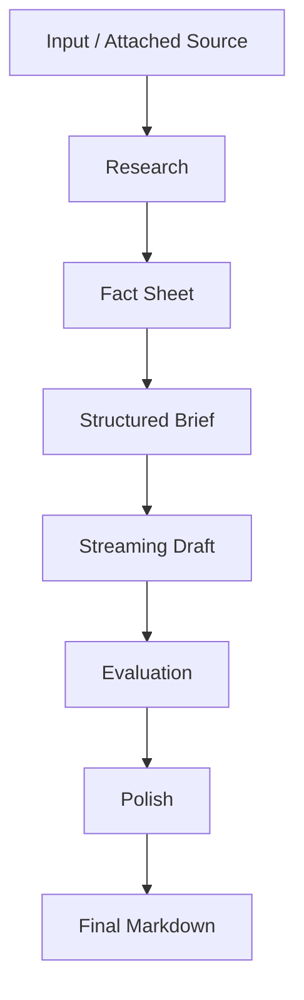

# AI Content Pipeline

## เป้าหมายของ pipeline นี้

สร้างคอนเทนต์ภาษาไทยที่อ่านดี แต่ยัง grounded กับข้อมูลจริง

## Flow หลัก

## Stage 1: Research

ใช้ `researchAndPreventHallucination()`

หน้าที่:

- derive research query
- ค้น Tavily
- ค้นโพสต์จาก X ทั้ง top/latest
- รวมข้อมูลเป็น fact sheet

จุดนี้คือหัวใจของการลด hallucination

## Stage 2: Brief

ใช้ `buildContentBrief()`

หน้าที่:

- สร้างโครงเนื้อหา
- กำหนด main angle
- ระบุ facts ที่ต้องมี
- ระบุ tone และ structure

ผลลัพธ์เป็น object ที่มี schema คุมด้วย `zod`

## Stage 3: Draft

ใช้ `generateStructuredContentV2()`

หน้าที่:

- เขียน draft จาก fact sheet + brief
- stream กลับไปที่ UI แบบ realtime
- ปรับตาม format, tone, length

## Stage 4: Evaluation + Polish

หลัง draft เสร็จ ระบบจะตรวจอีกชั้นว่า:

- หลุด fact sheet หรือไม่
- tone ตรงตามที่ขอหรือไม่
- ภาษาไทยดูเป็นธรรมชาติหรือไม่
- มี hype เกินจริงหรือไม่

จากนั้นค่อยคืน final markdown

## สิ่งที่ dev ควรจำ

- pipeline นี้แยก research ออกจาก writing อย่างตั้งใจ
- brief ช่วยให้ writer model เขียนตรงเป้าขึ้น
- evaluation pass ช่วยลด output ที่ดูเป็น generic AI copy
