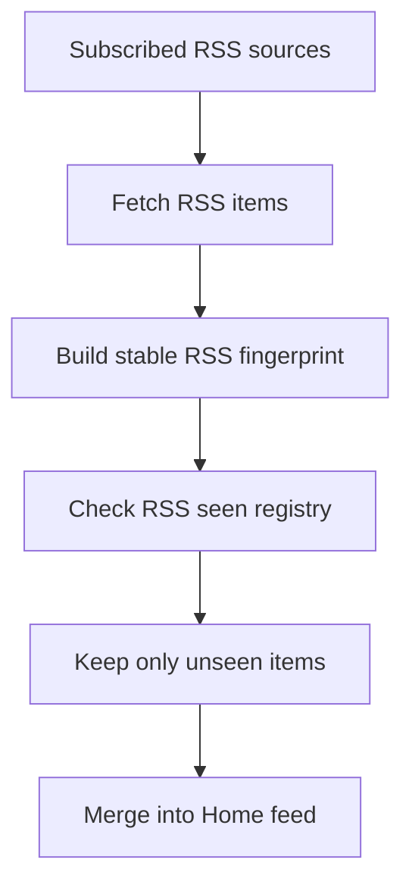
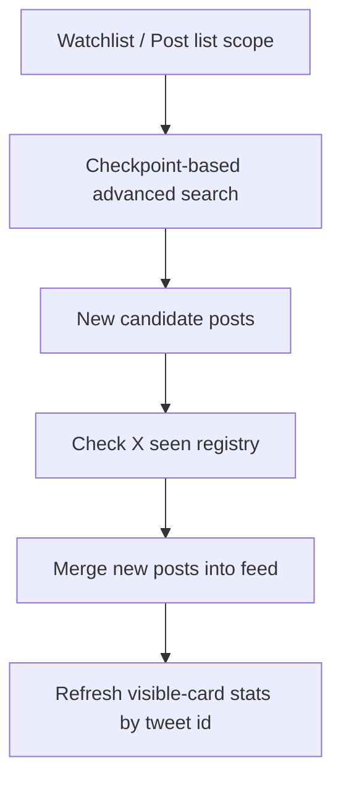

# Feed and Search Architecture

## Feed Architecture

Home feed now behaves as two related pipelines rather than one generic "fetch everything again" loop.

### RSS pipeline

Operational notes:

- RSS uses durable duplicate suppression during normal sync.
- The RSS seen registry is reset when the user intentionally clears Home feed.
- That reset allows previously seen RSS items to surface again after clear.

### X pipeline

Operational notes:

- X discovery and X stat refresh are separate concerns.
- Advanced search is used for new-post discovery.
- Tweet-id lookup is used to refresh engagement metrics for cards already visible on Home.
- If a tweet already exists, it should update the existing card rather than create a duplicate.
- Clearing Home feed does not reset X checkpoints or X seen state.

## Search Relationship

Search and Home are related but not identical:

- Search is an explicit research workflow.
- Home is a monitoring workflow.

That distinction matters for cost and UX:

- Home should prioritize cheap incremental discovery and light stat refresh.
- Search can justify broader and more expensive retrieval when the user is actively researching a topic.

## Plan-Limited Feed Surface

The Home surface is intentionally plan-limited:

- `Free`: 30 visible cards
- `Plus`: 100 visible cards

AI filter must use the same capped visible set. This prevents a mismatch where the UI shows one scope but the model processes another.

## Key Files

- `src/hooks/useHomeFeedWorkspace.ts`
- `src/services/RssService.ts`
- `src/services/TwitterService.ts`
- `src/utils/appUtils.ts`
