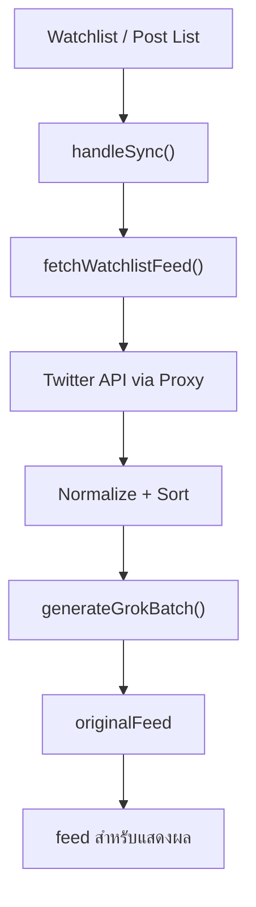
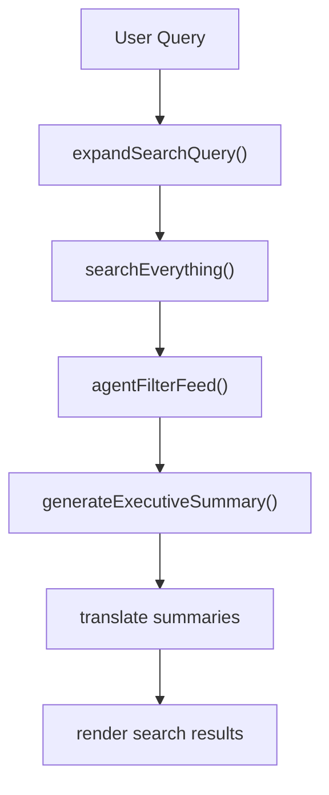

# Feed และ Search

## Feed Flow

feed ของระบบเริ่มจาก watchlist หรือ post list ที่ผู้ใช้เลือก

## แนวคิดสำคัญ

- ดึงข้อมูลจาก X ทีละ batch
- แปล/สรุปเป็นภาษาไทยทีละ chunk
- อัปเดต UI แบบ progressive ไม่รอครบทั้งหมด

## Search Flow

search ของระบบมี AI เข้ามาช่วยหลายจุด ไม่ใช่แค่ยิง query ตรงไปที่ X

## หน้าที่ของแต่ละส่วน

### `expandSearchQuery()`

ช่วยขยายคำค้นให้ครอบคลุมขึ้น เช่น รองรับคำไทย/อังกฤษหรือคำใกล้เคียง

### `searchEverything()`

ยิง query ไปยัง X search endpoint ผ่าน proxy แล้วคืนผลลัพธ์แบบ normalized

### `agentFilterFeed()`

ใช้ AI กรองโพสต์คุณภาพต่ำหรือไม่เกี่ยวข้องออก

### `generateExecutiveSummary()`

สรุปภาพรวมผลการค้นหาให้ผู้ใช้เข้าใจเร็ว

## Debug Checklist

ถ้า search มีปัญหา ให้เช็กตามลำดับนี้:

1. query ที่ส่งเข้า `expandSearchQuery()`
2. query ที่ถูกยิงจริงใน `searchEverything()`
3. จำนวนผลลัพธ์ก่อนและหลัง `agentFilterFeed()`
4. สถานะ `searchCursor`
5. การ merge summary กลับเข้า `searchResults`
