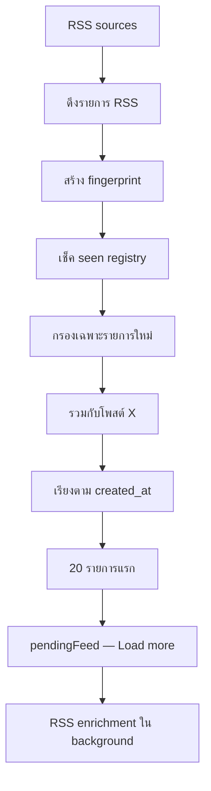
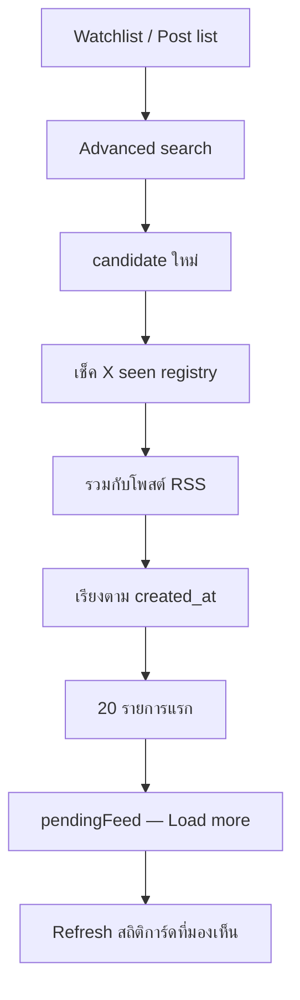

# สถาปัตยกรรมฟีดและการค้นหา

## สถาปัตยกรรมของฟีด

Home feed ทำงานแบบสองท่อข้อมูลที่เชื่อมกัน ไม่ใช่การ "ดึงทุกอย่างซ้ำ" แบบเดิม

### ท่อ RSS

หมายเหตุการทำงาน:

- RSS ใช้ระบบ dedup แบบถาวรระหว่าง sync ปกติ
- RSS seen registry จะถูก reset เมื่อผู้ใช้ล้าง Home feed โดยตั้งใจ
- การ reset นั้นทำให้บทความเก่าอาจกลับมาแสดงได้หลังจากล้าง
- RSS ไม่มี slot สำรองในรอบ sync แรก แต่แข่งกับโพสต์ X ตาม timestamp
- `/api/article` enrichment อยู่นอก critical path ของ sync แรกโดยตั้งใจ

### ท่อ X

หมายเหตุการทำงาน:

- การหาโพสต์ใหม่ของ X กับการ refresh สถิติเป็นคนละงานกัน
- ใช้ advanced search สำหรับการหาโพสต์ใหม่
- ใช้ tweet-id lookup สำหรับ refresh engagement ของการ์ดที่มองเห็นอยู่บน Home
- ถ้า tweet มีอยู่แล้วในฟีด ระบบควรอัปเดตการ์ดเดิมแทนการสร้างซ้ำ
- การล้าง Home feed จะไม่ reset X checkpoints หรือ X seen state
- รายการจาก X และ RSS ที่ผสมกันต้องเรียงตาม timestamp จริงก่อนตัดให้เหลือ 20 ใบแรก
- Home sync ต้องรอ feed-history hydration ครบก่อนเริ่ม fetch เพื่อไม่ให้ seen/checkpoint state ที่ยังไม่พร้อมทำให้รอบ sync ถูกตีความผิด

## ความสัมพันธ์ระหว่าง Search กับ Home

Search กับ Home มีความสัมพันธ์กันแต่ไม่เหมือนกัน:

- Search คือ workflow สำหรับค้นคว้าข้อมูลโดยตั้งใจ
- Home คือ workflow สำหรับมอนิเตอร์ข้อมูล

ความต่างนี้ส่งผลต่อต้นทุนและ UX:

- Home ควรเน้นการดึงข้อมูลใหม่แบบ incremental ราคาถูก และ refresh สถิติแบบเบา
- Search รับต้นทุนที่สูงกว่าได้เมื่อผู้ใช้กำลังค้นคว้าหัวข้อนั้นอยู่จริง

## เพดานฟีดตามแพ็กเกจ

พื้นที่แสดงผลของ Home ถูกจำกัดตามแพ็กเกจโดยตั้งใจ:

- `Free`: 30 cards ที่มองเห็นได้
- `Plus`: 100 cards ที่มองเห็นได้

และมี sync window สำหรับรอบแรก:

- รอบ sync แรก: รายการใหม่ที่รวมแล้วสูงสุด `20` ใบ
- ส่วนเกิน: เก็บไว้ใน pending state และดึงผ่าน `Load more`

AI filter ต้องใช้ชุดการ์ดที่มองเห็นได้ชุดเดียวกัน เพื่อป้องกัน mismatch ระหว่างสิ่งที่ UI แสดงกับสิ่งที่โมเดลประมวลผล

## ลำดับ Critical Path ของ Sync รอบแรก

Home sync รอบแรกควรทำตามลำดับนี้:

1. ดึง candidate จาก X และ RSS
2. ยืนยันว่า durable feed history hydrate ครบก่อนใช้ seen registry หรือ X checkpoint
3. ล้าง stale FORO Filter state ถ้าผู้ใช้กำลังดูผลกรองเดิมอยู่
4. Dedupe และ merge
5. เรียงรายการใหม่ทั้งหมดตาม `created_at`
6. ตัดเหลือ `20` รายการแรก
7. สรุปชุดแรกนั้นด้วย feed model ที่เร็ว
8. Render การ์ด

งานที่ไม่อยู่ใน critical path ทำหลังจากนั้น:

- RSS article image enrichment ผ่าน `/api/article`
- Retry แปลภาษาไทยสำหรับโพสต์ที่ fail รอบแรก
- การ์ดเพิ่มเติมผ่าน `Load more`

## ไฟล์หลักที่เกี่ยวข้อง

- `src/hooks/useHomeFeedWorkspace.ts`
- `src/services/RssService.ts`
- `src/services/TwitterService.ts`
- `src/utils/appUtils.ts`
