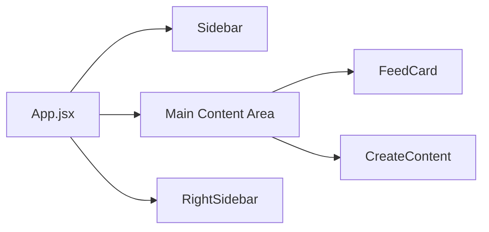

# Frontend Architecture

## หน้าที่ของ Frontend

frontend ของระบบนี้ไม่ได้เป็นแค่ layer แสดงผล แต่ทำหน้าที่เป็น orchestration layer ของ business flow เกือบทั้งหมด

ศูนย์กลางคือ `src/App.jsx`

หน้าที่หลัก:

- ถือ state หลักของระบบ
- เปลี่ยน view ตาม navigation
- เรียก service layer
- merge ผลลัพธ์กลับเข้า state
- sync state บางส่วนลง `localStorage`

## โครง UI หลัก

## View หลักในระบบ

`activeView` เป็นตัวคุมว่า UI ตอนนี้อยู่หน้าไหน เช่น:

- `home`
- `content`
- `read`
- `audience`
- `bookmarks`
- `search`

แนวคิดคือใช้หน้าเดียว แต่สลับ panel ตาม state แทนการใช้ router เต็มรูปแบบ

## แนวทาง state

state ถูกแบ่งคร่าว ๆ ได้ 3 กลุ่ม:

### 1. Domain state

- `watchlist`
- `feed`
- `originalFeed`
- `searchResults`
- `bookmarks`
- `readArchive`
- `postLists`

### 2. UI state

- `activeView`
- `contentTab`
- `listModal`
- `filterModal`
- `loading`
- `status`

### 3. Derived state

- feed ที่กรองตาม list
- search result ที่ sort ตาม view/engagement
- bookmark view ที่แยก news/article

## จุดที่ dev ควรรู้

- `originalFeed` เป็น source of truth ของ feed
- `feed` เป็นค่าที่ derive เพื่อแสดงผล
- search มี state แยกจาก home feed
- บาง feature share component เดียวกัน เช่น `FeedCard`

## ข้อดีและข้อควรระวัง

ข้อดี:

- อ่าน flow ง่าย
- data flow ตรง
- แก้ feature เร็ว

ข้อควรระวัง:

- `App.jsx` โตเร็ว
- state coupling สูง
- การ refactor ควรแยกเป็น custom hooks หรือ feature modules ในอนาคต
