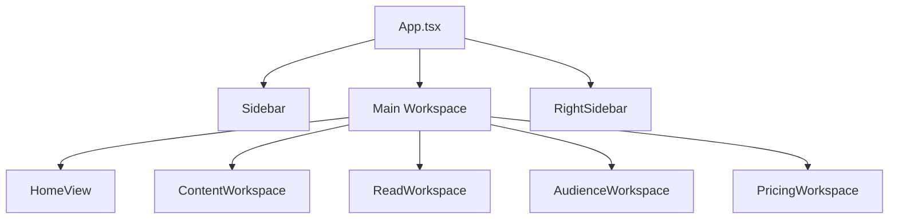

# Frontend Architecture

## หน้าที่ของ Frontend

frontend ของ Foro ไม่ได้เป็นแค่ layer แสดงผล แต่เป็น orchestration layer ของ workflow หลักเกือบทั้งหมด ทั้งการสลับ workspace, การจัด state, การประสาน service, และการแปล system state ให้ผู้ใช้เข้าใจผ่าน UI

ศูนย์กลางปัจจุบันคือ `src/App.tsx`

หน้าที่หลัก:

- ถือ state หลักของระบบ
- คุม `activeView` และ `contentTab`
- ประกอบ hook ระดับ feature เข้าด้วยกัน
- ส่ง props ลง workspace ที่เกี่ยวข้อง
- sync state ลง persistence layer
- รักษา history continuity ระหว่างการกลับหน้าและ modal state

## โครง UI หลัก

## Frontend เป็น 3 ชั้นในทาง UX

### 1. Shell layer

รับผิดชอบ:

- left rail
- main workspace frame
- right rail
- mobile bottom nav / mobile context switcher
- busy state ระดับแอป

### 2. Workspace layer

รับผิดชอบ:

- งานหลักของแต่ละหน้าจอ เช่น home, search, read, audience, pricing
- header, toolbar, empty state, loading state, result state

### 3. Artifact layer

รับผิดชอบ:

- object ที่นำกลับมาใช้ซ้ำข้าม workspace เช่น `FeedCard`, summary card, pills, list chip, modal

## View หลักในระบบ

`activeView` เป็นตัวคุมว่า UI ตอนนี้อยู่หน้าไหน:

- `home`
- `content`
- `read`
- `audience`
- `bookmarks`
- `pricing`

ภายใน `content` ยังมี `contentTab` สำหรับสลับ:

- `search`
- `create`

แนวคิดคือใช้ app shell เดียว แล้วสลับ workspace ตาม state แทนการใช้ page router แบบเต็มรูป

## แนวทาง state

state ถูกแบ่งได้ 3 กลุ่ม:

### 1. Domain state

- `watchlist`
- `originalFeed`
- `pendingFeed`
- `searchResults`
- `bookmarks`
- `readArchive`
- `postLists`
- `subscribedSources`

### 2. UI state

- `activeView`
- `contentTab`
- `listModal`
- `filterModal`
- `selectedArticle`
- `status`
- `bookmarkTab`
- `readSearchQuery`

### 3. Derived state

- `feed` ที่ derive จาก source + list + filter + plan limit
- bookmark / read views ที่ filtered แล้ว
- search suggestions และ search choice states
- UI history snapshot สำหรับ back/forward continuity

## UX contract ที่ผูกกับ architecture นี้

- `originalFeed` เป็น source of truth ส่วน `feed` คือ presentation state
- `FeedCard` ต้อง reuse ข้ามหลาย workspace เพื่อให้ mental model ต่อเนื่อง
- right rail เป็น supporting context ไม่ใช่ main content
- pricing เป็น workspace เดียวที่ intentionally ซ่อน right rail
- mobile ต้องเปลี่ยน interaction model แต่ยังคงชื่อ state และ object เดิม

## Animation และ interaction ไม่ใช่เรื่องตกแต่ง

ใน frontend นี้ animation ถูกใช้เพื่อแปล state:

- hover ยืนยันว่า element กดได้
- skeleton บอกว่ากำลังเติมข้อมูล
- summary reveal บอกว่าระบบประมวลผลเสร็จแล้ว
- expand panel บอกความสัมพันธ์ parent-child ของ post list

ดังนั้นเวลาปรับ frontend architecture ห้ามมอง motion เป็นของประดับอย่างเดียว เพราะมันเป็นส่วนหนึ่งของ usability contract

รายละเอียดระดับ screen และ animation contract อยู่ใน [UX/UI README](/ux-ui-readme)

## จุดที่ dev ควรรู้ก่อนแก้

- `src/App.tsx` ยังเป็น integration point หลัก
- `useHomeFeedWorkspace`, `useSearchWorkspace`, `useLibraryViews`, `useAudienceSearch` เป็น hook หลักที่ shape behavior ของ UX
- `src/index.css` ไม่ได้เก็บแค่ style แต่เก็บ layout contract และ motion contract จำนวนมาก
- การแก้ชื่อ state หรือ interaction ควรอัปเดต docs ไปพร้อมกัน

## ข้อดีและข้อควรระวัง

ข้อดี:

- data flow ตรง
- trace behavior กลับหา source ได้ง่าย
- workspace มี boundary ค่อนข้างชัด

ข้อควรระวัง:

- `App.tsx` โตง่ายและ coupling สูง
- style contract กระจุกอยู่ใน `src/index.css`
- ถ้า refactor ต้องระวังไม่ให้ shell contract, mobile behavior, และ shared component semantics หลุด
