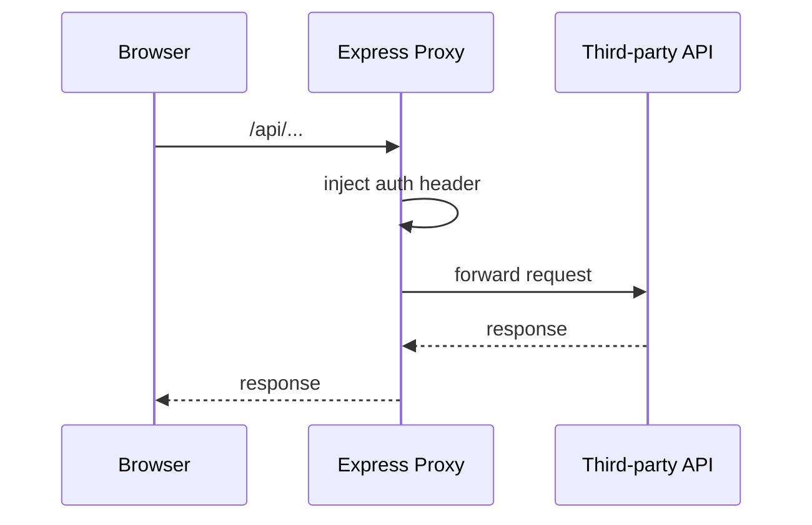

# Proxy และ External APIs

## บทบาทของ `server.cjs`

backend ตัวนี้เป็น proxy layer บาง ๆ ที่คั่นระหว่าง browser กับ third-party APIs

## API Routes

| Route | ปลายทาง |
| :--- | :--- |
| `/api/twitter/*` | `https://api.twitterapi.io` |
| `/api/xai/*` | `https://api.x.ai` |
| `/api/tavily/search` | `https://api.tavily.com/search` |

## ทำไมต้องมี proxy

- ซ่อน API keys
- ลดปัญหา CORS
- รวม integration logic ไว้จุดเดียว
- ทำให้ frontend เรียก path ภายในระบบแทนการคุยกับ third-party ตรง

## Request Flow

## สิ่งที่ควรพัฒนาต่อในอนาคต

- structured logging
- retry policy
- timeout control
- rate limit handling
- metrics สำหรับ upstream latency/error
