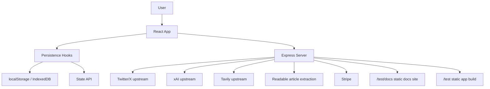

# Foro Architecture Overview

## Purpose

Foro is a single application that combines feed discovery, audience research, article reading, bookmarking, and AI-assisted content creation. The current codebase is split between a React frontend, an Express integration layer, and a VitePress documentation site that is shipped alongside the app.

## System Diagram

## Main Runtime Pieces

### Frontend

Core frontend responsibilities live in:

- `src/App.tsx`
- `src/components/AppWorkspaceRouter.tsx`
- `src/hooks/useHomeFeedWorkspace.ts`
- `src/hooks/useSearchWorkspace.ts`
- `src/hooks/useAudienceSearch.ts`
- `src/hooks/useBilling.ts`

Key points:

- `App.tsx` owns the cross-workspace state graph.
- workspace routing is view-driven, not URL-route-driven inside the SPA shell.
- most heavy workspaces are lazy-loaded.
- persistence is abstracted through shared hooks and adapters rather than direct ad hoc storage access.

### Backend

The server entrypoints are:

- `server/app.cjs`
- `server.cjs`

The server is responsible for:

- internal API auth gate on `/api`
- upstream proxying
- state storage APIs
- article extraction
- Stripe checkout session management
- serving the production app and docs outputs

## Workspace Model

The frontend currently exposes six top-level workspaces:

- `home`
- `content`
- `read`
- `audience`
- `bookmarks`
- `pricing`

This workspace split is important because many product rules are scoped by active view, especially feed visibility, AI filtering, saved content behavior, and mobile navigation handling.

## Persistence Model

The current app uses two persistence paths:

- browser persistence through local storage and IndexedDB-backed hooks
- backend persistence through `/api/state/:namespace/:key`

This lets the app keep feature code mostly storage-agnostic while still supporting a backend-backed mode when needed.

## Integration Surface

Current server-facing integrations include:

- X/Twitter upstream via `/api/twitter/*`
- xAI via `/api/xai/*`
- Tavily via `/api/tavily/search`
- article extraction via `/api/article`
- RSS fetching via `/api/rss`
- Stripe checkout via `/api/billing/*`

## Docs Architecture

The repo also includes a generated docs system:

- VitePress content lives in `docs/`
- generated data lives in `docs/.vitepress/data`
- docs status, changelog, and draft suggestions are regenerated by scripts before docs dev/build/preview

Production serving exposes:

- app at `/test`
- docs at `/test/docs`

## Current Architectural Constraints

- `src/App.tsx` still carries a large orchestration surface.
- workspace state is intentionally centralized, which improves coordination but increases file size and coupling.
- Home feed sync depends on durable feed-history hydration, so UI and usage guards must treat hydration as part of the sync contract.
- Presentation filters such as FORO Filter are not durable feed source state; a fresh sync should clear stale filter presentation before showing refreshed data.
- some feature docs are still behind newer source commits, so generated docs status should be checked during behavior changes.

## Read Next

- [Frontend Architecture](/architecture/frontend)
- [Feed Search Architecture](/architecture/feed-search)
- [AI Pipeline](/architecture/ai-pipeline)
- [Integrations](/architecture/integrations)
- [State](/architecture/state)
