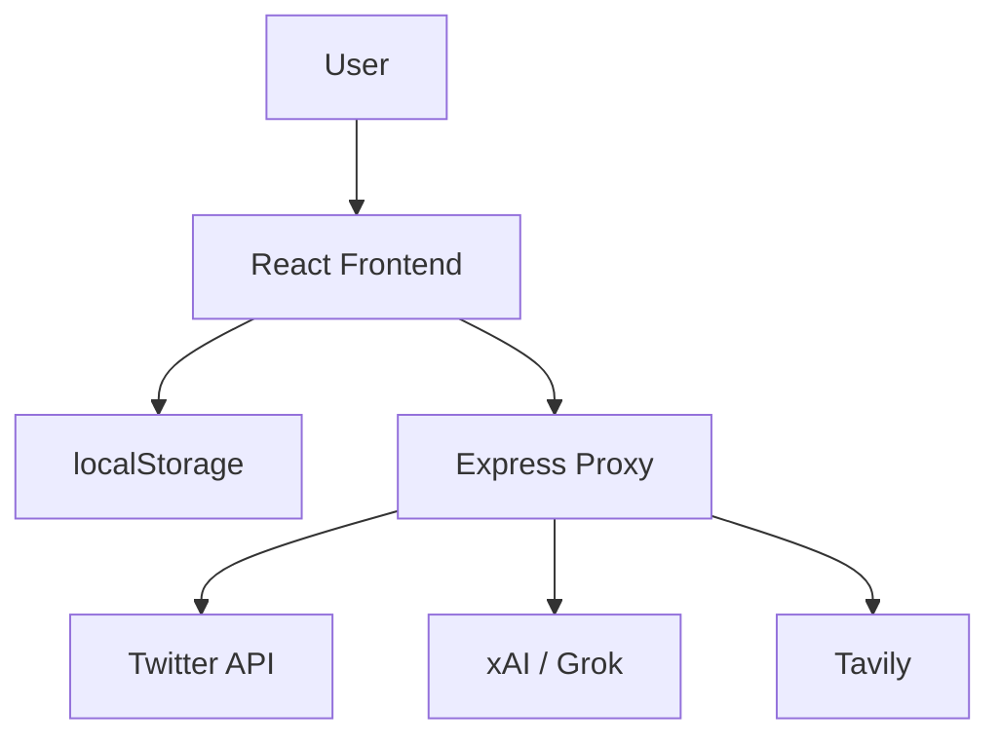
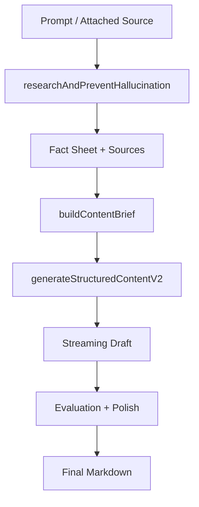

# Foro Architecture Overview

## บทนำ

Foro เป็นระบบข่าวและสร้างคอนเทนต์ภาษาไทยที่รวม 3 ความสามารถหลักไว้ในแอปเดียว:

- ดึง feed และค้นหาข้อมูลจาก X
- ใช้ AI เพื่อคัดกรอง สรุป แปล และจัดระเบียบข้อมูล
- ใช้ AI pipeline เพื่อสร้างคอนเทนต์จากข้อมูลที่ผ่านการ research แล้ว

ในเชิงสถาปัตยกรรม ระบบนี้เป็น React SPA ที่มี Express proxy เป็นชั้นเชื่อมต่อกับ external services

## ภาพรวมระบบ

## โครงสร้างหลัก

### Frontend

จุดเริ่มต้นของแอปอยู่ที่ `src/main.jsx` และ controller หลักของระบบอยู่ที่ `src/App.jsx`

`App.jsx` รับผิดชอบเรื่องต่อไปนี้

- ถือ state หลักของระบบ
- orchestration การทำงานของแต่ละ feature
- เรียก service layer เพื่อคุยกับ API และ AI

### Service Layer

- `src/services/TwitterService.js`: ดึงข้อมูล user, feed, search และ thread context
- `src/services/GrokService.js`: สรุปข่าว, filter feed, expand query, research, fact sheet และ content generation
- `src/utils/markdown.js`: render markdown อย่างปลอดภัย

### Proxy Layer

`server.cjs` ทำหน้าที่เป็น API gateway สำหรับ:

- `/api/twitter`
- `/api/xai`
- `/api/tavily/search`

หน้าที่หลักคือซ่อน key, จัดการ CORS และเป็น integration boundary ของระบบ

## Feature Flows

### 1. Feed Sync

flow หลัก:

1. ผู้ใช้เพิ่ม account เข้า watchlist
2. ระบบเรียก `fetchWatchlistFeed()`
3. service สร้าง query แบบ batch
4. proxy ส่งคำขอไป Twitter API
5. frontend รับผลลัพธ์ กลั่นข้อมูล และแปล summary ภาษาไทยแบบเป็น chunk

จุดสำคัญคือใช้ `originalFeed` เป็น source of truth แล้ว derive `feed` สำหรับแสดงผล

### 2. Search + AI Filter

flow หลัก:

1. ผู้ใช้กรอกคำค้น
2. AI ขยาย query ด้วย `expandSearchQuery()`
3. ระบบค้นหาผ่าน `searchEverything()`
4. AI คัดโพสต์คุณภาพด้วย `agentFilterFeed()`
5. AI สรุปภาพรวมด้วย `generateExecutiveSummary()`
6. แปล summary ของแต่ละโพสต์เป็นภาษาไทยแบบ progressive

### 3. Audience Discovery

ระบบช่วยหา expert account ตาม topic ที่ผู้ใช้สนใจ

1. ผู้ใช้กรอกหัวข้อ
2. AI สร้างรายชื่อ expert candidate
3. frontend แสดงรายการ
4. เมื่อผู้ใช้กดเพิ่ม จะเรียก `getUserInfo()` เพื่อ verify ตัวตนจริงก่อนเพิ่มเข้า watchlist

### 4. Content Generation Pipeline

flow หลัก:

จุดเด่นของ pipeline นี้คือแยก research ออกจาก writing อย่างชัดเจน เพื่อลด hallucination และทำให้ output น่าเชื่อถือขึ้น

## Data Persistence

ระบบปัจจุบันใช้ `localStorage` เป็นหลักในการเก็บ state เช่น:

- watchlist
- home feed
- bookmarks
- read archive
- post lists
- content generation draft

ข้อดีคือเริ่มใช้งานง่าย แต่ข้อจำกัดคือข้อมูลยังผูกกับ browser/device เดียว

## ข้อสังเกตเชิงสถาปัตยกรรม

จุดแข็ง:

- พัฒนา feature ได้เร็ว
- AI workflow ชัด
- UX ดีจาก progressive update และ streaming

ข้อจำกัด:

- `src/App.jsx` ใหญ่และรวมหลาย domain
- state หลักยังกระจุกอยู่จุดเดียว
- persistence ยังเป็น local-only

## เอกสารฉบับเต็ม

สำหรับรายละเอียดเชิงลึกของแต่ละฟีเจอร์ อ่านต่อได้ที่ [architecture-th.md](/architecture-th)
