# โครงแอปหลัก (App Shell)

## เป้าหมายของฟีเจอร์

App Shell คือโครง UI รอบนอกของแอปที่ทำให้ผู้ใช้สลับไปมาระหว่าง workspace ต่าง ๆ ได้ เห็นสถานะงานพื้นฐาน และเข้าถึง plan panel, post list, และ Foro Docs ได้จากทุกหน้าหลัก

## Component Diagram

```mermaid
flowchart TD
    SIDEBAR[Sidebar.tsx] -- activeView --> APP

    subgraph APP["App.tsx - Central State"]
        STATE[activeView · feed · lists · plan]
    end

    STATE --> ROUTER[AppWorkspaceRouter]
    STATE --> RSIDEBAR[RightSidebar]
    STATE --> PLAN[PlanPanel]

    subgraph VIEWS["Workspaces"]
        HOME[Home]
        CONTENT[Content]
        READ[Read]
        AUDIENCE[Audience]
        BOOKMARKS[Bookmarks]
        PRICING[Pricing]
    end

    ROUTER --> HOME & CONTENT & READ & AUDIENCE & BOOKMARKS & PRICING
    PRICING -- ซ่อน --> RSIDEBAR

    style APP fill:#1e293b,stroke:#334155
    style VIEWS fill:#052e16,stroke:#166534
```

## พฤติกรรมปัจจุบัน

- แกนหลักของ shell ถูกประกอบใน `App.tsx`
- `Sidebar` ใช้สลับ `activeView` ระหว่าง home, content, read, audience, bookmarks และ pricing
- shell แสดง background task indicator เมื่อมีการ sync, search, generate หรือ filtering
- `PlanPanel` แสดงข้อมูลแผน, usage คงเหลือ, ปุ่มเปิด Pricing และปุ่มเปิด Foro Docs
- `RightSidebar` ถูกซ่อนเมื่ออยู่หน้า pricing
- บน mobile shell เปลี่ยนจาก 3-column layout เป็น bottom navigation + context switcher ตาม workspace

## UX Intent ของ App Shell

- shell ต้องทำให้ผู้ใช้รู้ทันทีว่าอยู่ workspace ไหน
- rail ซ้ายต้องนิ่งและเชื่อถือได้
- rail ขวาต้องเป็น supporting context ไม่แย่งจอหลัก
- mobile ต้อง prioritize current task ก่อน secondary context
- plan panel ต้องทำหน้าที่เป็น utility hub ไม่ใช่แค่ billing card

## ลำดับการใช้งานหลัก

1. ผู้ใช้เปิดแอปและเห็น shell หลัก
2. ผู้ใช้สลับ workspace จาก sidebar หรือ mobile navigation
3. ผู้ใช้เปิด plan panel เพื่อดู usage, pricing, หรือ docs
4. ผู้ใช้เปิด right sidebar เพื่อจัดการ post list และ supporting context

## กฎสำคัญที่ห้ามหลุด

- navigation item ต้องสะท้อน `activeView` ปัจจุบันอย่างถูกต้อง
- background task indicator ต้องไม่แสดงสถานะหลอก
- ปุ่ม `Foro Docs` ต้องพาไป docs route ที่แอปเสิร์ฟจริง
- shell layout ต้องยังรองรับการซ่อน `RightSidebar` เมื่อเข้า pricing
- mobile context switcher ต้องสอดคล้องกับ workspace ปัจจุบัน

## UI States ที่ต้องนึกถึงเวลาแก้

- Active Navigation: เมนูด้านซ้าย highlight ตรงกับ view ปัจจุบัน
- Busy Shell: มี spinner/indicator เมื่อมีงาน background
- Plan Panel Closed: เห็น summary แบบย่อ
- Plan Panel Open: เห็น usage stats และ action buttons
- Pricing Open: main workspace ขยาย focus และซ่อน right rail
- Mobile Context Mode: แสดง shortcut ตามงานที่ผู้ใช้กำลังทำ

## ไฟล์หลักที่เกี่ยวข้อง

- `src/App.tsx`
- `src/components/Sidebar.tsx`
- `src/components/PlanPanel.tsx`
- `src/components/RightSidebar.tsx`
- `src/index.css`

## Dependency สำคัญ

- state ของ `activeView`
- background task flags
- billing summary และ usage limits
- route ของ Foro Docs ที่ถูกเสิร์ฟจากแอป

## สิ่งที่ฟีเจอร์นี้ไม่ได้เป็นเจ้าของ

- รายละเอียดภายในของแต่ละ workspace
- logic การ consume usage ของแต่ละ feature
- เนื้อหา docs ภายใน Foro Docs เอง

## เอกสารที่ต้องอ่านต่อ

- [UX/UI README](/ux-ui-readme)
- [Frontend Architecture](/architecture/frontend)

## Change Log

- 2026-04-13: ขยายเอกสาร app shell ให้รวม mobile shell behavior และ UX intent
