# โครงแอปหลัก (App Shell)

## เป้าหมายของฟีเจอร์

App Shell คือโครง UI รอบนอกของแอปที่ทำให้ผู้ใช้สลับไปมาระหว่าง workspace ต่างๆ ได้ เห็นสถานะงานพื้นฐาน และเข้าถึง panel เรื่องแผนการใช้งานหรือ docs ได้จากทุกหน้าหลัก

## Component Diagram

```mermaid
flowchart TD
    SIDEBAR[Sidebar.tsx] -- activeView --> APP

    subgraph APP["App.tsx — Central State"]
        STATE[activeView · feed · lists · plan]
    end

    STATE --> ROUTER[AppWorkspaceRouter]
    STATE --> RSIDEBAR[RightSidebar]
    STATE --> TASKS[Task Indicator]
    STATE --> PLAN[PlanPanel]

    subgraph VIEWS["Workspaces"]
        HOME[Home]
        CONTENT[Content]
        READ[Read]
        AUDIENCE[Audience]
        BOOKMARKS[Bookmarks]
        PRICING[Pricing]
    end

    ROUTER --> HOME & CONTENT & READ & AUDIENCE & BOOKMARKS & PRICING
    PRICING -- ซ่อน --> RSIDEBAR

    style APP fill:#1e293b,stroke:#334155
    style VIEWS fill:#052e16,stroke:#166534
```

## พฤติกรรมปัจจุบัน

- แกนหลักของ shell ถูกประกอบใน `App.tsx`
- `Sidebar` ใช้สลับ `activeView` ระหว่าง home, content, read, audience, bookmarks และ pricing
- shell แสดง background task indicator เมื่อมีการ sync, search, generate หรือ filtering
- `PlanPanel` แสดงข้อมูลแผน, usage คงเหลือ, ปุ่มเปิด Pricing และปุ่มเปิด Foro Docs
- `RightSidebar` ถูกซ่อนเมื่ออยู่หน้า pricing

## ลำดับการใช้งานหลัก

1. ผู้ใช้เปิดแอปและเห็น shell หลัก
2. ผู้ใช้สลับ workspace จาก sidebar
3. ผู้ใช้เปิด plan panel เพื่อดู usage หรือเปิด Foro Docs / Pricing

## กฎสำคัญที่ห้ามหลุด

- navigation item ต้องสะท้อน `activeView` ปัจจุบันอย่างถูกต้อง
- background task indicator ต้องไม่แสดงสถานะหลอก
- ปุ่ม `Foro Docs` ใน plan panel ต้องพาไป route docs ที่แอปเสิร์ฟจริง
- ปุ่ม `Pricing` ต้องยังพาผู้ใช้เข้าสู่ pricing flow ตามเดิม
- shell layout ต้องยังรองรับการซ่อน `RightSidebar` เมื่อเข้า pricing

## UI States ที่ต้องนึกถึงเวลาแก้

- Active Navigation: เมนูด้านซ้าย highlight ตรงกับ view ปัจจุบัน
- Busy Shell: มี spinner/indicator เมื่อมีงาน background
- Plan Panel Closed: ผู้ใช้เห็นแค่ summary card
- Plan Panel Open: ผู้ใช้เห็น usage stats และ action buttons
- Pricing Open: layout ปรับเพื่อซ่อน right sidebar

## ไฟล์หลักที่เกี่ยวข้อง

- `src/App.tsx`
- `src/components/Sidebar.tsx`
- `src/components/PlanPanel.tsx`
- `src/components/RightSidebar.tsx`

## Dependency สำคัญ

- state ของ `activeView`
- background task flags
- billing summary และ usage limits
- route ของ Foro Docs ที่ถูกเสิร์ฟจากแอป

## สิ่งที่ฟีเจอร์นี้ไม่ได้เป็นเจ้าของ

- รายละเอียดภายในของแต่ละ workspace
- logic การ consume usage ของแต่ละ feature
- เนื้อหา docs ภายใน Foro Docs เอง

## สัญญาณว่าควรอัปเดตเอกสารหน้านี้

- เปลี่ยน navigation item
- เปลี่ยน plan panel actions
- เปลี่ยนเส้นทางของ Foro Docs หรือ Pricing
- เปลี่ยนพฤติกรรมของ shell layout

## Change Log

- 2026-04-09: สร้างเอกสาร baseline ภาษาไทยสำหรับ App Shell
