# พื้นที่บุ๊กมาร์ก (Bookmarks)

## เป้าหมายของฟีเจอร์

Bookmarks Workspace เป็นคลังของสิ่งที่ผู้ใช้บันทึกไว้ โดยแยกการดูออกเป็นมุมข่าวและมุมบทความ เพื่อให้จัดการสิ่งที่เซฟไว้ได้ง่ายขึ้นโดยไม่ต้องย้อนกลับไปหาใน feed เดิม

## Data Flow Diagram

```mermaid
flowchart TD
    BMSTATE[bookmarks state — App.tsx]

    subgraph WS["BookmarksWorkspace.tsx"]
        NEWS[แท็บ News — FeedCard]
        ARTICLE[แท็บ Article]
    end

    subgraph Actions["Actions"]
        OPEN[เปิดอ่าน]
        ATTACH[ส่งสร้างคอนเทนต์]
        REMOVE[ลบ bookmark]
    end

    BMSTATE --> NEWS & ARTICLE
    NEWS --> OPEN & ATTACH
    ARTICLE --> REMOVE

    style WS fill:#1e293b,stroke:#334155
    style Actions fill:#052e16,stroke:#166534
```

## พฤติกรรมปัจจุบัน

- เปิดภายใต้ `activeView = "bookmarks"`
- ใช้ `bookmarkTab` เพื่อสลับระหว่าง `news` และ `article`
- ถ้าอยู่แท็บ `news` ระบบจะแสดงรายการด้วย `FeedCard`
- ถ้าอยู่แท็บ `article` ระบบจะแสดง article card แบบอ่านเร็ว พร้อมปุ่มลบบทความออกจาก bookmarks
- ถ้ามี active list อยู่ หน้านี้จะแสดง pill เพื่อบอก context ของ list ปัจจุบัน

## ลำดับการใช้งานหลัก

1. ผู้ใช้เข้ามาที่ Bookmarks Workspace
2. ผู้ใช้สลับดูระหว่างแท็บข่าวกับแท็บบทความ
3. ผู้ใช้เปิดอ่านต่อ ส่งไปสร้างคอนเทนต์ หรือเอา bookmark ออก

## กฎสำคัญที่ห้ามหลุด

- `bookmarkTab` ต้องเป็นตัวกำหนดรูปแบบการ render จริง ไม่ใช่แค่เปลี่ยนหัวข้อ
- ในแท็บ `article` การลบรายการต้องกระทบ state ของ bookmarks โดยตรง
- รายการ bookmark ที่เป็นข่าวยังต้องใช้ action ชุดเดียวกับ `FeedCard`
- context ของ active list ถ้ามี ต้องยังมองเห็นจากหัวหน้าจอ

## UI States ที่ต้องนึกถึงเวลาแก้

- News Tab: แสดงข่าวที่ bookmark ไว้
- Article Tab: แสดงบทความที่ bookmark ไว้
- Empty Collection: ไม่มีรายการให้แสดงในแท็บปัจจุบัน
- Remove Flow: มีการยืนยันก่อนลบบทความในแท็บ article

## ไฟล์หลักที่เกี่ยวข้อง

- `src/App.tsx`
- `src/components/BookmarksWorkspace.tsx`
- `src/components/FeedCard.tsx`

## Dependency สำคัญ

- shared bookmark state
- article reader flow
- content generation handoff

## สิ่งที่ฟีเจอร์นี้ไม่ได้เป็นเจ้าของ

- การค้นหา feed ใหม่
- pricing และ plan gating
- RSS source catalog

## สัญญาณว่าควรอัปเดตเอกสารหน้านี้

- เปลี่ยนประเภทของแท็บ
- เปลี่ยนวิธี render article bookmarks
- เปลี่ยนวิธีลบ bookmark
- เปลี่ยน action ที่มีในแต่ละแท็บ

## Change Log

- 2026-04-09: สร้างเอกสาร baseline ภาษาไทยสำหรับ Bookmarks Workspace
