# พื้นที่ทำคอนเทนต์

## เป้าหมาย

Content Workspace เชื่อมการค้นหา source เข้ากับการสร้างคอนเทนต์ โดยไม่บังคับให้ผู้ใช้ต้องประกอบ context ใหม่ทุกครั้ง

flow ที่ตั้งใจไว้คือ:

`เจอสัญญาณ -> เปิดดูต้นทาง -> แนบ source ที่ใช่ไว้ -> สร้างคอนเทนต์ภาษาไทย`

## Data Flow Diagram

```mermaid
flowchart TD
    subgraph WS["ContentWorkspace.tsx"]
        SEARCH[โหมด Search]
        ATTACH[Attached Sources]
        CREATE[โหมด Create]
    end

    subgraph Pipeline["CreateContent.tsx — AI Pipeline"]
        P1[1. Research]
        P2[2. Fact Sheet]
        P3[3. Content Brief]
        P4[4. Draft — streaming]
        P5[5. Evaluation]
        P6[6. Polish]
        P1 --> P2 --> P3 --> P4 --> P5 --> P6
    end

    subgraph APIs["External APIs"]
        TAVILY[Tavily]
        GROK[GrokService]
        XAPI[TwitterService]
    end

    OUT[Final Markdown]

    SEARCH --> ATTACH --> CREATE --> P1
    P1 --> TAVILY & GROK & XAPI
    P4 --> GROK
    P6 --> OUT

    style WS fill:#1e293b,stroke:#334155
    style Pipeline fill:#1e1b4b,stroke:#3730a3
    style APIs fill:#1c1917,stroke:#78350f
```

## กติกาของโปรดักต์ตอนนี้

### Workspace แบบสองโหมด

- workspace นี้มีทั้งโหมด search และ create
- โหมด search ใช้สำหรับหา source candidate และ inspect ข้อมูล
- โหมด create ใช้สำหรับสร้างหรือ regenerate คอนเทนต์จาก context ที่เลือกไว้

### พฤติกรรมของ content search

- ถ้าผู้ใช้พิมพ์หัวข้อเป็นภาษาไทย แต่ไม่ได้ระบุ scope แบบ local ชัดเจน เช่น `ในไทย`, `Thailand`, `คนไทย` หรือบริบทประเทศ/ภูมิภาคอื่น ระบบต้องถือว่า search นี้เป็น global-first
- global-first search ต้องขยาย query ไปทางภาษาอังกฤษหรือคำค้นสากลก่อน ทั้งสำหรับ X search, web context และ query planning แทนการล็อกอยู่กับคำไทยตรง ๆ
- Thai-local RSS sources ต้องไม่ถูกดึงมาเป็น fallback โดยอัตโนมัติสำหรับ global-first search เพื่อไม่ให้ผลลัพธ์ local กลบหัวข้อสากล
- ถ้าผู้ใช้ระบุ scope ไทยหรือ local ชัดเจน ระบบค่อยเปิดใช้ local fallback queries และ RSS sources ที่เป็นไทยได้

### market price search

- search intent ประเภทแนวโน้มราคา เช่นทองหรือ silver ต้องมี deterministic query lane สำหรับ X เป็นภาษาอังกฤษโดยตรง เพื่อไม่ให้ผลลัพธ์แกว่งตามการตีความ prompt แต่ละครั้ง
- lane นี้แยกอย่างน้อยเป็น entity/market query และ viral-or-engagement query เพื่อจับทั้งโพสต์อัปเดตราคาและโพสต์ที่มีสัญญาณแรง
- สำหรับ market price intent ระบบต้องมี Top engagement backfill อีกชั้น โดยขยายช่วงเวลาและยก `min_faves` ขึ้น เพื่อเก็บโพสต์วิเคราะห์หรือสรุปภาพใหญ่ที่ไม่ได้อยู่แค่ในหน้าต่างล่าสุด

### พฤติกรรมการแนบ source

- source ที่เลือกสามารถ attach แล้วพกต่อเข้าไปใน flow สร้างคอนเทนต์ได้
- state ของ attached source ควรอยู่ต่อได้ระหว่างการ navigate ปกติและการสลับ workspace
- แผง attached source ถูกตั้งใจให้อยู่ในรูปแบบ compact เพื่อไม่กินพื้นที่เขียนหลัก
- ความ compact สำคัญ เพราะเมื่อผู้ใช้พร้อมเขียน textarea ควรเป็นพื้นที่ทำงานหลัก

### พฤติกรรมการแปลใน article reader

- flow ของ RSS และ article reader ใช้ reader modal ร่วมกัน
- การแปลบทความเป็นแบบ on-demand และใช้เส้นทางแปลปัจจุบันของ xAI
- ถ้าผู้ใช้เปิดบทความ RSS เดิมซ้ำ แอปควร reuse translation cache ที่คงอยู่ แทนการจ่ายต้นทุนแปลซ้ำ

### สัญญาของ translation cache

- translation cache ควรถูก key ด้วยตัวตนที่เสถียรของบทความ เช่น RSS fingerprint, article id หรือ canonical URL
- เมื่อเปิด source เดิมซ้ำ ระบบควรพยายามใช้ผลลัพธ์ภาษาไทยที่ cache ไว้ก่อน
- ควรขอแปลใหม่ก็ต่อเมื่อยังไม่มีผลลัพธ์ cache ที่เสถียรเท่านั้น

## ลำดับการใช้งานหลัก

1. ผู้ใช้เปิด Content Workspace
2. ผู้ใช้ค้นหาหรือดู source candidate
3. ผู้ใช้เปิด source ใน reader เมื่ออยากดูบริบทเพิ่ม
4. ผู้ใช้ attach source ที่ต้องการเข้า flow สร้างคอนเทนต์
5. ผู้ใช้เขียน prompt หรือไอเดีย
6. ระบบสร้าง draft โดยอิงจาก context ที่ attach ไว้
7. ผู้ใช้สามารถ regenerate จาก context เดิมได้โดยไม่ต้องตั้งค่าใหม่

## UX ของ attachment ในโหมด create

การ์ด attached source ควรทำหน้าที่เป็น reference block ขนาดกะทัดรัด ไม่ใช่ content panel เต็มขนาดอีกชิ้นหนึ่ง

layout ที่คาดหวังตอนนี้คือ:

- ยังเห็นตัวตนของ source ชัด
- ยังเห็น headline ในรูปแบบสั้น
- มี summary แต่ต้องถูก clamp
- preview image ต้องคงขนาดเล็ก
- ปุ่ม remove ต้องเข้าถึงง่าย
- attachment ต้องไม่ดัน editor ลงไปลึกเกินไป

## Edge Cases สำคัญ

### เปิดบทความ RSS เดิมซ้ำ

- reader ควรใช้คำแปลภาษาไทยที่ cache ไว้แล้วถ้ามี
- ผู้ใช้ไม่ควรรู้สึกว่าต้องรอแปลรอบที่สองสำหรับบทความเดิม

### summary ที่แนบมายาวมาก

- summary ใน attachment ต้องถูก clamp ทางภาพ เพื่อให้ editor ยังเด่นที่สุด

### source ที่เป็นวิดีโอจาก X

- source ประเภทวิดีโอจาก X อาจต้องมี hint ด้าน context เพิ่ม เพราะ flow สร้างคอนเทนต์วิเคราะห์วิดีโอได้
- แต่แม้ในกรณีนี้ attached block ก็ยังต้องคงความ compact

## ไฟล์หลักที่เกี่ยวข้อง

- `src/components/ContentWorkspace.tsx`
- `src/components/CreateContent.tsx`
- `src/components/ArticleReaderModal.tsx`
- `src/hooks/useSearchWorkspace.ts`
- `src/services/GrokService.ts`
- `src/services/ArticleService.ts`
- `src/utils/searchQueryPlanning.js`

## เมื่อไรต้องอัปเดตหน้านี้

อัปเดตหน้านี้เมื่อมีการเปลี่ยน:

- การ persist ของ attached source
- พฤติกรรม query planning, fallback, หรือ scope ของ content search
- พฤติกรรมการแปลใน article reader
- พฤติกรรมของ translation cache
- gating ของ create mode หรือสิทธิ์ premium
- layout หรือความหนาแน่นของข้อมูลใน attached source

## Change Log

- 2026-04-29: documented global-first search defaults for Thai input, Thai-local RSS fallback gating, and deterministic market-price X query lanes with Top engagement backfill
- 2026-04-12: documented durable article translation reuse and compact attached-source layout expectations in create mode
