# หน้าโฮมฟีด

## เป้าหมาย

Home Feed คือ workspace หลักสำหรับการมอนิเตอร์ใน Foro และควรตอบคำถามนี้ให้เร็วที่สุด:

`มีอะไรเปลี่ยนในแหล่งที่เราสนใจบ้าง และชิ้นไหนควรได้รับความสนใจตอนนี้`

ประสบการณ์ของ Home มีหน้าที่:

- sync โพสต์จาก X ตาม watchlist หรือ post list ที่เลือกอยู่
- sync รายการ RSS จากแหล่งข่าวที่ subscribe ไว้
- dedupe รายการเพื่อให้ฟีดยังอ่านง่ายและควบคุมต้นทุนได้
- ให้ผู้ใช้ sort, filter, เปิดอ่าน, bookmark หรือส่ง source ไปต่อใน flow สร้างคอนเทนต์
- รัน AI filter บนชุดข้อมูลที่ผู้ใช้มองเห็นได้ตามแพ็กเกจปัจจุบัน

## Data Flow Diagram

```mermaid
flowchart TD
    subgraph Sources["แหล่งข้อมูล"]
        RSS[RssService]
        X[TwitterService]
    end

    subgraph Core["useHomeFeedWorkspace"]
        MERGE[merge + dedup]
        SORT[sort by time]
        WINDOW[20 cards แรก]
        PENDING[pendingFeed]
    end

    subgraph Limit["Plan Limit — pricingPlans.ts"]
        FREE[Free · 30 cards]
        PLUS[Plus · 100 cards]
    end

    subgraph UI["UI"]
        FEEDCARD[FeedCard]
        GROK[AI Filter — GrokService]
        RSIDEBAR[RightSidebar]
    end

    RSS --> MERGE
    X --> MERGE
    MERGE --> SORT
    SORT --> WINDOW
    WINDOW --> LIMITCHECK{Apply plan limit}
    WINDOW -- overflow --> PENDING
    FREE --> LIMITCHECK
    PLUS --> LIMITCHECK
    LIMITCHECK --> FEEDCARD
    FEEDCARD --> GROK
    GROK --> RSIDEBAR
    PENDING -- Load more --> FEEDCARD

    style Sources fill:#1e293b,stroke:#334155
    style Core fill:#1e1b4b,stroke:#3730a3
    style Limit fill:#27272a,stroke:#52525b
    style UI fill:#052e16,stroke:#166534
```

## กติกาของโปรดักต์ตอนนี้

### องค์ประกอบของฟีด

- Home สามารถมีทั้งการ์ดจาก X และการ์ดจาก RSS
- post list ที่ active อยู่จะเปลี่ยนขอบเขตของทั้ง handle จาก X และแหล่ง RSS ที่นำมารวม
- การ render การ์ดอยู่ใน Home view ส่วน orchestration หลักอยู่ใน `src/hooks/useHomeFeedWorkspace.ts`

### เพดานจำนวนการ์ดตามแพ็กเกจ

- Home มีเพดานจำนวนการ์ดที่มองเห็นได้ตามแพ็กเกจ:
  - `Free`: 30 cards
  - `Plus`: 100 cards
- sync รอบแรกมี soft window สำหรับการประมวลผลที่ `20` รายการล่าสุดต่อครั้ง แม้ active post list จะรวมทั้ง X และ RSS
- ถ้าหลัง merge และ sort ตามเวลาแล้วมีรายการใหม่เกิน `20` ระบบต้องแสดงแค่ `20` ใบแรกก่อน และเก็บส่วนเกินไว้ใน `pendingFeed`
- `Load more` จะหยุดเมื่อถึงเพดานของแพ็กเกจนั้น
- AI filter ใช้ขอบเขตเดียวกับการ์ดที่มองเห็นอยู่ และจะไม่ไปรันบนชุดข้อมูลที่ซ่อนไว้ใหญ่กว่า

### ลำดับการแสดงผลของ X และ RSS

- รายการใหม่จาก X และ RSS ต้องถูกรวมเข้าด้วยกันก่อน แล้ว sort ตาม `created_at` แบบรวมชุด
- ถ้า RSS ใหม่กว่า X ในรอบ sync เดียวกัน RSS ต้องอยู่ก่อน
- ถ้า X ใหม่กว่า RSS ในรอบ sync เดียวกัน X ต้องอยู่ก่อน
- การตัดเหลือ `20` ใบแรกเกิดหลังจาก sort รวมแล้วเท่านั้น ห้ามแยก quota X กับ RSS ก่อน sort

### นโยบาย dedupe ของ RSS

- RSS ใช้ stable RSS fingerprint เพื่อระบุว่ารายการไหนซ้ำ
- ระหว่าง sync ปกติ ถ้ารายการเดิมจาก RSS source เดิมเคยเห็นแล้ว ต้องไม่กลับมาเป็นการ์ดใหม่อีก
- พฤติกรรมนี้ช่วยทั้งลดการอ่านซ้ำของผู้ใช้ และลดงานแปลหรือ AI ซ้ำที่ไม่จำเป็น

### พฤติกรรมเมื่อกดล้างฟีด RSS

- `Clear feed` เป็นการ reset ประวัติ RSS แบบตั้งใจ
- การล้าง Home feed จะล้าง RSS seen registry ด้วย
- หลังจาก reset แล้ว บทความเก่าจาก RSS อาจกลับมาแสดงใหม่ได้ในการ sync รอบถัดไป

### นโยบาย sync ของ X

- X feed ถูกออกแบบให้แยก 2 งานจากกัน:
  - หาโพสต์ใหม่ที่เพิ่งถูกเผยแพร่
  - refresh สถิติของการ์ดที่กำลังแสดงอยู่บน Home
- การหา candidate ใหม่ใช้ checkpoint-based advanced search
- การ refresh engagement ของการ์ดที่มีอยู่แล้ว ใช้ tweet-id lookup เฉพาะการ์ดที่กำลังมองเห็น
- ถ้าโพสต์จาก X ที่เข้ามามีอยู่แล้วในฟีด ระบบควรอัปเดตการ์ดเดิมแทนการสร้างซ้ำ

### Feed history hydration และ FORO Filter ระหว่าง sync

- Home sync ต้องรอให้ประวัติฟีด durable hydrate ครบก่อนเริ่ม fetch จริง โดยสถานะนี้รวม `rssSeenRegistry`, `xSeenRegistry`, และ `xSyncCheckpoints`
- ปุ่ม `ฟีดข้อมูล` ต้อง disabled และแสดง spinner ระหว่างรอ hydrate เพื่อป้องกันการกดที่ไม่เกิดผลและไม่ควร consume quota
- guard ใน `src/App.tsx` ต้องเช็ก hydration ก่อน `tryConsumeFeature('feed')` เพื่อไม่หัก usage เมื่อ sync ยังทำงานจริงไม่ได้
- เมื่อผู้ใช้กด sync รอบใหม่ขณะมีผล `FORO Filter` ค้างอยู่ ระบบต้องล้าง filtered view, summary, brief, และ prompt ก่อน เพื่อกลับไปแสดงฟีดล่าสุดตามจริง
- พฤติกรรมนี้ตั้งใจป้องกันเคสเปิดแอปข้ามวันแล้วเห็นผลกรองจากเมื่อวาน แม้ sync รอบใหม่จะมีข้อมูลเข้ามาแล้วก็ตาม

### งาน background หลังการ์ดขึ้นครบ

- critical path ของ Home sync ควรจบเมื่อการ์ดรอบแรกถูก sort, สรุป และแสดงครบแล้ว
- RSS image enrichment ผ่าน `/api/article` เป็นงาน background เท่านั้น และต้องไม่ทำให้เวลา settle ของ sync แรกช้าลง
- งาน enrichment นี้ควรเริ่มหลังช่วง summarize/backfill หลัก และต้องอัปเดตภาพกลับเข้า feed โดยไม่เปลี่ยนลำดับการ์ด

### พฤติกรรมเมื่อกดล้างฟีด X

- การล้าง Home feed จะไม่ reset X checkpoints หรือ X seen state
- พฤติกรรมนี้ตั้งใจไว้เพื่อให้หลังล้างฟีดแล้ว การ sync รอบถัดไปยังเน้นโพสต์ใหม่ และไม่เสียต้นทุนไปกับการประมวลผลโพสต์เก่าที่ผู้ใช้ไม่ได้เห็นแล้ว

### การกรองตาม post list

- membership ของ post list ต้องถูก normalize ให้สอดคล้องกันทั้งฝั่ง X handles และ RSS source ids
- เพื่อป้องกัน false empty state ที่ list มี source จริง แต่ดูเหมือนว่างเพราะรูปแบบ key ที่เก็บไม่ตรงกัน

## ลำดับการใช้งานหลัก

1. ผู้ใช้เปิดหน้า Home
2. ผู้ใช้ sync ข้อมูลฟีดตาม watchlist หรือ post list ที่ใช้งานอยู่
3. ระบบรวมรายการจาก X และ RSS เข้ากับ state ของฟีดปัจจุบัน
4. ระบบ sort รายการใหม่รวมกันตามเวลา แล้วแสดงเฉพาะ `20` ใบแรกในรอบแรก
5. ผู้ใช้สามารถกด `Load more` เพื่อดึงส่วนที่เก็บใน pending queue ต่อได้
6. ผู้ใช้สามารถ sort, bookmark, เปิด reader หรือ attach source ไปยัง flow สร้างคอนเทนต์ได้
7. ผู้ใช้สามารถรัน AI filter บนฟีดที่มองเห็นได้ตามแพ็กเกจปัจจุบัน
8. ผู้ใช้สามารถล้างฟีดได้ โดย RSS กับ X จะมี semantics การ reset ต่างกันตามที่อธิบายไว้ด้านบน

## ชื่อใน UI ที่ผูกกับคำในเอกสาร

ตารางนี้ใช้เป็นตัวแปลระหว่างคำที่เห็นบนหน้าจอ กับคำที่ใช้ในเอกสารหน้านี้ เพื่อให้คุยกันตรงกันง่ายขึ้น

| ชื่อบน UI | ใช้เรียกใน doc ว่าอะไร | ความหมายในระบบตอนนี้ |
| :--- | :--- | :--- |
| `ฟีดข้อมูล` | sync feed / การ sync ฟีด | ปุ่มดึงข้อมูลล่าสุดเข้าหน้า Home จาก X และ RSS |
| `FORO Filter` | AI filter | ปุ่มเปิด flow กรองฟีดด้วย AI บนชุดการ์ดที่มองเห็นอยู่ |
| `กำลังกรอง` | AI filter กำลังทำงาน | state ระหว่าง AI filter กำลังประมวลผล |
| `โพสต์ล่าสุด` | feed list / รายการบน Home | ส่วนที่แสดงการ์ดทั้งหมดในหน้า Home |
| `กำลังกรองตาม: <ชื่อ list>` | active post list | บอกว่าตอนนี้ Home จำกัดขอบเขตตาม post list ไหนอยู่ |
| `ยอดวิว` | sort by view | ปุ่มเรียงการ์ดตามยอดวิว |
| `เอนเกจเมนต์` | sort by engagement | ปุ่มเรียงการ์ดตาม engagement |
| `เคลียร์ฟีด` | clear feed | ล้างฟีดปัจจุบันออกจาก Home |
| `ฟื้นฟู` | undo clear | เอาฟีดชุดล่าสุดกลับมาหลังเพิ่งกดล้าง |
| `ล้าง` / `ล้างตัวกรอง` | clear AI filter | เอาผลการกรองของ AI ออก แล้วกลับไปดูฟีดปกติ |
| `แสดงครบ <n> การ์ดตามแพ็กแล้ว` | plan-based card limit reached | ถึงเพดานการ์ดที่มองเห็นได้ตามแพ็กเกจ |
| `โหลดเพิ่มเติม` | load more | ดึงการ์ดเพิ่มจากคิว pending หรือ cursor ถัดไป |

อ้างอิงจาก UI จริงใน `src/components/HomeView.tsx` เช่น `ฟีดข้อมูล`, `FORO Filter`, `โพสต์ล่าสุด`, `เคลียร์ฟีด`, `ฟื้นฟู`, `ยอดวิว`, `เอนเกจเมนต์` และ `โหลดเพิ่มเติม`

## สัญญาของ AI Filter

- AI filter ควรเป็นชั้นวิเคราะห์บน Home ไม่ใช่แหล่งข้อมูลอีกก้อนหนึ่ง
- มันต้องประเมินจากชุดการ์ดที่ผู้ใช้มองเห็นและใช้งานได้จริงในขณะนั้น
- ถ้าฟีดถูกจำกัดด้วยแพ็กเกจ AI filter ก็ต้องเคารพเพดานเดียวกัน
- ผลลัพธ์ของ AI filter ต้องยังรักษา citations, reasoning context และการ trace กลับไปยังการ์ดต้นทางได้

## Edge Cases สำคัญ

### ผู้ใช้ล้างฟีด

- ประวัติ RSS จะถูก reset และบทความเก่าอาจกลับมาได้
- ประวัติ X จะไม่ถูก reset และการ sync รอบถัดไปยังคงคุมต้นทุนเหมือนเดิม

### ผู้ใช้เลือก post list

- ขอบเขตของฟีดต้องสะท้อน post list ที่เลือกอย่างสม่ำเสมอทั้ง X และ RSS
- ถ้า list มี source ตรงกัน Home ต้องไม่แสดง empty state ปลอมเพราะ normalization ไม่ตรงกัน

### ผู้ใช้ sync ซ้ำโดยไม่ล้างฟีด

- RSS ควร suppress บทความเก่าจาก source เดิมต่อไป
- X ควรหาโพสต์ใหม่และ refresh สถิติของการ์ดที่มองเห็น โดยไม่ทำให้โพสต์เก่ากลายเป็นรายการใหม่

### ผู้ใช้มี post list ที่รวม X และ RSS

- ระบบต้อง merge รายการใหม่จากทั้งสองแหล่งแล้ว sort ตามเวลาจริงก่อนเสมอ
- รอบแรกต้องแสดงไม่เกิน `20` ใบ แม้จำนวนรายการใหม่รวมจะมากกว่า `20`
- รายการที่เกินจากรอบแรกต้องถูกเก็บไว้ให้ `Load more`
- งาน RSS article enrichment ต้องไม่เปลี่ยน order ของการ์ดที่แสดงแล้ว

## ไฟล์หลักที่เกี่ยวข้อง

- `src/App.tsx`
- `src/components/HomeView.tsx`
- `src/hooks/useHomeFeedWorkspace.ts`
- `src/services/RssService.ts`
- `src/services/TwitterService.ts`
- `src/utils/appUtils.ts`

## เมื่อไรต้องอัปเดตหน้านี้

อัปเดตหน้านี้ทันทีเมื่อมีการเปลี่ยน:

- พฤติกรรมการ sync
- พฤติกรรม dedupe
- พฤติกรรม clear หรือ reset
- เพดานการ์ดตามแพ็กเกจ
- ขอบเขตของ AI filter
- semantics ของ membership ใน post list

## Change Log

- 2026-04-23: documented feed-history hydration guard, pre-quota sync blocking, and automatic FORO Filter clearing when a fresh sync starts
- 2026-04-13: documented first-pass `20` card sync window, cross-source chronological ordering for mixed X plus RSS lists, `Load more` overflow behavior, and background-only RSS article enrichment
- 2026-04-12: documented durable RSS dedupe, RSS reset-on-clear behavior, X checkpoint plus visible-card stat refresh flow, post-list normalization fixes, and Home plan caps (`Free 30 / Plus 100`)
- 2026-04-12: added UI-to-doc naming map for Home Feed actions and states
