# แหล่งข่าว (News Sources)

## เป้าหมายของฟีเจอร์

News Sources ช่วยให้ผู้ใช้เลือกแหล่งข่าว RSS ที่ระบบรองรับ คัดดูตาม topic หรือ language context และ subscribe source เหล่านั้นเข้ามาอยู่ในชุดข้อมูลที่ใช้งานจริงของตัวเอง

## Data Flow Diagram

```mermaid
flowchart TD
    CATALOG[rssCatalog.ts]

    subgraph UI["NewsSourcesTab.tsx"]
        FEATURED[Featured Sources]
        TOPIC[Topic Filter]
        TOGGLE[Subscribe / Unsubscribe]
        LISTASSIGN[Add to Post List]
    end

    subgraph Persist["Persistence"]
        STATE[subscription state]
        CLIENT[persistence/client]
    end

    RSS[RssService] --> HOME[useHomeFeedWorkspace]

    CATALOG --> FEATURED
    CATALOG --> TOPIC
    FEATURED --> TOGGLE
    TOPIC --> TOGGLE
    TOGGLE --> STATE
    STATE --> CLIENT
    CLIENT --> RSS
    RSS --> HOME
    TOGGLE --> LISTASSIGN

    style UI fill:#1e1b4b,stroke:#3730a3
    style Persist fill:#052e16,stroke:#166534
```

## พฤติกรรมปัจจุบัน

- ฟีเจอร์นี้ implement หลักอยู่ใน `NewsSourcesTab`
- ใช้ RSS catalog กลางเป็น canonical source registry ของระบบ
- รองรับการจัดกลุ่มตาม topic การเรียง featured sources แยกตามภาษา และการ toggle subscribe/unsubscribe
- ถ้า parent view ส่ง action ที่เกี่ยวข้องเข้ามา ฟีเจอร์นี้สามารถพา RSS source เข้าไปอยู่ใน post list ได้ด้วย

## ลำดับการใช้งานหลัก

1. ผู้ใช้เปิดหน้าจอ News Sources
2. ผู้ใช้ไล่ดู featured sources หรือกลุ่มตาม topic
3. ผู้ใช้ subscribe หรือ unsubscribe แหล่งข่าวที่ต้องการ
4. ผู้ใช้อาจเพิ่ม source เข้า post list ต่อจากหน้านี้ได้ ถ้า flow นั้นถูกเปิดใช้งาน

## กฎสำคัญที่ห้ามหลุด

- RSS catalog คือ source of truth ของ provider ที่เปิดใช้ได้และ metadata ที่ normalize แล้ว
- featured ordering ของชุดภาษาอังกฤษกับภาษาไทยต่างกัน และต้องไม่ถูกรวม logic กันมั่ว
- subscription state ต้อง persist และอยู่ต่อหลัง reload
- การ toggle source ต้อง reversible คือกดซ้ำแล้วกลับสถานะได้
- ถ้ามีการเปลี่ยน source metadata หรือ featured logic ต้องอัปเดต docs หน้านี้และเช็กผลกระทบกับ feed หรือ workspace อื่นด้วย

## UI States ที่ต้องนึกถึงเวลาแก้

- Catalog browsing: เห็น cards ของ source พร้อม topic filters
- Filtered list: แสดงเฉพาะ source ที่ตรง filter
- Empty state: ไม่มี source ตรงกับ filter ปัจจุบัน
- List assignment menu: source ถูกเพิ่มเข้า post list ได้หนึ่งหรือหลาย list

## ไฟล์หลักที่เกี่ยวข้อง

- `src/components/NewsSourcesTab.tsx`
- `src/config/rssCatalog.ts`
- `src/App.tsx`
- `src/hooks/usePostLists.ts`

## Dependency สำคัญ

- state ของ subscribed sources ที่ persist
- state ของ post list membership
- metadata และ topic labels จาก RSS catalog

## สิ่งที่ฟีเจอร์นี้ไม่ได้เป็นเจ้าของ

- Feed ranking logic after source content has already been fetched
- AI content generation
- Billing and plan gating

## สัญญาณว่าควรอัปเดตเอกสารหน้านี้

- เปลี่ยน logic การเรียง featured sources
- เปลี่ยนวิธี grouping ตาม topic หรือภาษา
- เปลี่ยนความหมายของ subscribe หรือ unsubscribe
- เปลี่ยน flow การพา source เข้า post list

## Change Log

- 2026-04-09: สร้างเอกสาร baseline ภาษาไทยสำหรับ News Sources
