# หน้าแพ็กเกจ

## เป้าหมาย

Pricing Workspace ต้องอธิบายความต่างของแพ็กเกจในแบบที่เชื่อมกับพฤติกรรมของโปรดักต์จริง ไม่ใช่มีแค่ภาษาการตลาด

ผู้ใช้ควรเข้าใจได้ว่า:

- ตอนนี้ตัวเองอยู่แพ็กเกจไหน
- เหลือ quota รายวันอีกเท่าไร
- มี object limits อะไรบ้าง
- มีข้อจำกัดเชิง workflow อะไรที่กระทบ Home, AI filter และการใช้งาน watchlist

## Plan Limits Diagram

```mermaid
flowchart LR
    subgraph Plans["pricingPlans.ts"]
        FREE["Free Plan"]
        PLUS["Plus Plan"]
    end

    subgraph HomeLimits["Home Feed Limits"]
        FREE_CARDS["30 cards visible"]
        PLUS_CARDS["100 cards visible"]
    end

    subgraph AIFilter["AI Filter Scope"]
        AI_SCOPE["กรองเฉพาะ cards\nที่ผู้ใช้มองเห็นได้\n(เคารพ plan limit)"]
    end

    subgraph ObjectLimits["Object Limits"]
        WATCHLIST_CAP["Watchlist capacity"]
        LIST_CAP["Post list capacity"]
        QUOTA["Daily quota\n(feed / search / generate)"]
    end

    subgraph Checkout["PricingWorkspace.tsx"]
        DISPLAY["แสดง current plan\n+ usage + limits"]
        UPGRADE["Checkout flow\n→ Stripe"]
    end

    FREE --> FREE_CARDS
    PLUS --> PLUS_CARDS
    FREE_CARDS & PLUS_CARDS --> AI_SCOPE
    Plans --> ObjectLimits
    Plans --> DISPLAY
    DISPLAY --> UPGRADE

    style Plans fill:#1e293b,stroke:#334155
    style HomeLimits fill:#1e1b4b,stroke:#3730a3
    style AIFilter fill:#1c1917,stroke:#78350f
    style ObjectLimits fill:#27272a,stroke:#52525b
    style Checkout fill:#052e16,stroke:#166534
```

## กติกาของโปรดักต์ตอนนี้

### แพ็กเกจที่เปิดสาธารณะ

- `Free`
- `Plus`

### การบอกเพดานของ Home feed ในรายละเอียดแพ็กเกจ

รายละเอียดแพ็กเกจตอนนี้ต้องแสดงเพดานของ Home feed และ AI filter อย่างชัดเจน:

- `Free`: 30 cards
- `Plus`: 100 cards

เรื่องนี้สำคัญ เพราะ Home feed และ AI filter เป็น workflow ที่ผู้ใช้สัมผัสได้จริง ไม่ใช่ implementation detail ภายในที่ซ่อนอยู่

### การสื่อสารเรื่องการใช้งาน

Pricing ยังต้องแสดง quota รายวันของฟีเจอร์เดิม เช่น feed, search และ generate

นอกจากนี้ต้องสื่อสารข้อจำกัดของพื้นที่ทำงานจริงด้วย เช่น:

- ความจุของ watchlist
- ความจุของ post list
- เพดานการ์ดของ Home feed และ AI filter

### เส้นทาง checkout

- เมื่อเลือก `Plus` ระบบจะเปิด purchase flow
- การเปลี่ยนแพ็กเกจที่ไม่ใช่ checkout ยังคงใช้ internal plan-selection path เดิม

## ลำดับการใช้งานหลัก

1. ผู้ใช้เปิดหน้า Pricing
2. ผู้ใช้เปรียบเทียบแพ็กเกจปัจจุบันกับอีกแพ็กเกจหนึ่ง
3. ผู้ใช้ตรวจดู quota รายวันและ limits ของแต่ละ workspace
4. ผู้ใช้ตัดสินใจว่าจะอัปเกรดหรือไม่

## Edge Cases สำคัญ

### เอกสารหรือข้อความหน้า Pricing ตามไม่ทันของจริง

- ถ้าพฤติกรรมของโปรดักต์เปลี่ยน แต่รายละเอียดแพ็กเกจไม่พูดถึง ผู้ใช้จะเข้าใจ contract ผิด
- เพดานของ Home feed เป็นตัวอย่างชัดเจนของ behavior ที่ต้องบอกบนหน้า Pricing

### เพดาน workflow ที่ถูกซ่อนไว้

- ถ้า workflow ใดถูกจำกัดตามแพ็กเกจในทางปฏิบัติ Pricing ควรบอกตรงๆ
- ผู้ใช้ไม่ควรต้องไปชนลิมิตใน Home ก่อนถึงจะเพิ่งรู้ว่ามีเพดาน

## ไฟล์หลักที่เกี่ยวข้อง

- `src/components/PricingWorkspace.tsx`
- `src/config/pricingPlans.ts`
- `src/components/PlanPanel.tsx`

## เมื่อไรต้องอัปเดตหน้านี้

อัปเดตหน้านี้เมื่อมีการเปลี่ยน:

- รายการแพ็กเกจ
- quota รายวัน
- limit ของ watchlist หรือ post list
- limit ของ Home feed หรือ AI filter
- checkout หรือ upgrade flow

## Change Log

- 2026-04-12: documented Home feed and AI filter plan ceilings and aligned plan details with `Free 30 / Plus 100`
