# Read Workspace

## เป้าหมายของฟีเจอร์

Read Workspace เป็นคลังสำหรับบทความหรือโพสต์ที่ผู้ใช้บันทึกไว้อ่านต่อ จุดสำคัญคือช่วยให้ย้อนกลับมาทบทวนรายการเดิมได้ง่าย เปิดอ่านแบบเต็มได้ และต่อยอดไปยังการสร้างคอนเทนต์ได้โดยไม่หลุดบริบท

## Data Flow Diagram

```mermaid
flowchart TD
    subgraph Entry["Read Workspace (activeView = read)"]
        ARCHIVE["readArchive\n(persisted list)"]
        SEARCH_IN["Search / Filter\n(กรองภายใน archive)"]
        VISIBLE["visibleReadCount\nbatch loading"]
    end

    subgraph Card["FeedCard.tsx"]
        ACTIONS["bookmark / attach to content\n/ open reader"]
    end

    subgraph Reader["ArticleReaderModal.tsx"]
        EXTRACT["ArticleService.ts\nextract(url)"]
        SERVER["server/app.cjs\nPOST /api/extract\n→ Mozilla Readability"]
        RENDER["render clean article"]
    end

    subgraph Translation["Translation (on-demand)"]
        TRANSLATE["GrokService.ts\ngrok-4-1-fast-non-reasoning"]
        CHUNK["chunk by paragraph\n(title แยกจาก body)"]
        CLEANUP["post-process cleanup\n(คำแปลเพี้ยนที่เจอบ่อย)"]
        CACHE["Translation Cache\nkey: RSS fingerprint / URL"]
    end

    ARCHIVE --> SEARCH_IN
    SEARCH_IN --> VISIBLE
    VISIBLE --> Card
    Card -- "เปิดบทความ" --> Reader
    EXTRACT --> SERVER
    SERVER --> RENDER
    RENDER -- "ไม่ใช่ภาษาไทย" --> TRANSLATE
    TRANSLATE --> CHUNK --> CLEANUP
    CLEANUP --> CACHE
    CACHE -- "เปิดซ้ำ = reuse" --> RENDER

    style Entry fill:#1e293b,stroke:#334155
    style Card fill:#052e16,stroke:#166534
    style Reader fill:#1e1b4b,stroke:#3730a3
    style Translation fill:#1c1917,stroke:#78350f
```

## พฤติกรรมปัจจุบัน

- เปิดภายใต้ `activeView = "read"`
- แสดงรายการจาก `readArchive` ที่ถูก persist ไว้
- มี search input, suggestion pills และตัวกรอง `view` กับ `engagement`
- ใช้ `FeedCard` เป็นการ์ดรายการหลัก ทำให้ bookmark ซ้ำ เปิดอ่านต่อ หรือส่งไปสร้างคอนเทนต์ได้
- รองรับการโหลดเพิ่มทีละ batch ผ่าน `visibleReadCount`
- สำหรับ RSS / web article ที่กดอ่านเต็ม ระบบจะเปิด `ArticleReaderModal` เพื่อโหลด reader view จากต้นทาง
- ถ้าต้นฉบับไม่ได้เป็นภาษาไทย ระบบจะแปลเป็นไทยอัตโนมัติด้วย `grok-4-1-fast-non-reasoning`
- การแปลบทความยาวจะแยก `title` ออกจาก `body` และ split body เป็น chunk ตามย่อหน้าเพื่อลดอาการแปลแข็งหรือสรุปเอง
- มี post-process cleanup สำหรับคำแปลเพี้ยนที่เจอบ่อยในข่าวภาษาอังกฤษ

## ลำดับการใช้งานหลัก

1. ผู้ใช้เข้ามาที่ Read Workspace
2. ผู้ใช้ค้นหาหรือกด suggestion เพื่อกรองรายการใน archive
3. ผู้ใช้เปิดอ่านรายการที่สนใจ
4. ถ้าเป็นบทความภายนอก ระบบจะโหลด reader view และแปลไทยใน modal
5. ผู้ใช้คัดลอกบทความ เปิดต้นฉบับ หรือส่งต่อไปยัง flow สร้างคอนเทนต์

## กฎสำคัญที่ห้ามหลุด

- `readArchive` คือ source หลักของหน้านี้ ถ้าไม่มีรายการต้องแสดง empty state ที่ชัด
- search เป็นการกรองภายใน archive ไม่ใช่การยิงค้นหาใหม่จากภายนอก
- filter `view` และ `engagement` ต้องมีผลกับรายการที่แสดงจริง
- load more ต้องเพิ่มจำนวนรายการที่เห็นโดยไม่ทำให้รายการเดิมหายหรือ reorder แบบไม่ตั้งใจ
- article reader ต้องรักษา facts, names, dates, numbers และ quotes จากต้นฉบับไว้เสมอ
- บทความยาวต้องผ่าน chunking ต่อไป ห้ามถอยกลับไปส่งทั้งก้อนถ้าทำให้คุณภาพตก

## UI States ที่ต้องนึกถึงเวลาแก้

- Empty Library: ยังไม่มีรายการใน archive
- Search Active: มีคำค้นหรือ suggestion ที่กำลังกรองอยู่
- Empty Search: มี archive แต่ไม่พบรายการที่ตรงกับคำค้น
- Filtered Results: รายการถูกจัดตาม filter ปัจจุบัน
- Load More Available: ยังมีรายการซ่อนอยู่และสามารถกดโหลดเพิ่มได้
- Reader Loading: กำลังโหลด reader view หรือตัวแปล
- Reader Error: โหลดต้นฉบับไม่ได้หรือแปลไม่สำเร็จ

## ไฟล์หลักที่เกี่ยวข้อง

- `src/App.tsx`
- `src/components/ReadWorkspace.tsx`
- `src/components/FeedCard.tsx`
- `src/components/ArticleReaderModal.tsx`
- `src/services/ArticleService.ts`
- `src/services/GrokService.ts`

## Dependency สำคัญ

- `readArchive` persistence
- search suggestion state ของ archive
- shared article actions จาก `FeedCard`
- article extraction จาก `ArticleService`
- article translation flow ใน `GrokService`

## สิ่งที่ฟีเจอร์นี้ไม่ได้เป็นเจ้าของ

- การ fetch feed ใหม่จากแหล่งข้อมูลภายนอก
- การจัดการ pricing
- logic หลักของ content generation

## สัญญาณว่าควรอัปเดตเอกสารหน้านี้

- เปลี่ยนวิธีค้นหาหรือ suggestion logic
- เปลี่ยนการจัดการ load more
- เปลี่ยนความหมายของ filter
- เปลี่ยน article reader flow หรือ translation strategy
- เปลี่ยน empty/search-empty/error behavior

## Change Log

- 2026-04-09: สร้างเอกสาร baseline สำหรับ Read Workspace
- 2026-04-11: อัปเดต article reader translation flow ให้ตรงกับ `grok-4-1-fast-non-reasoning`, chunking บทความยาว, และ cleanup หลังแปล
