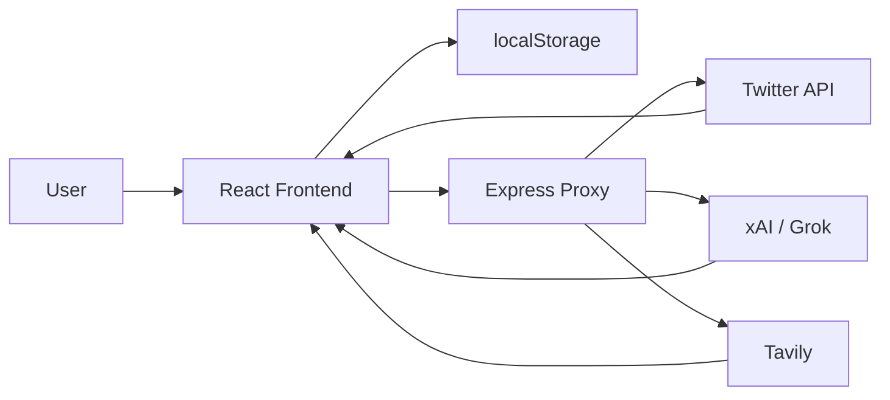
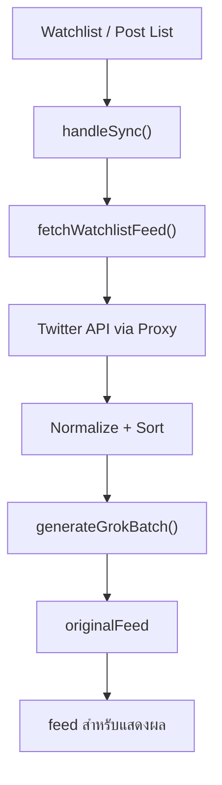
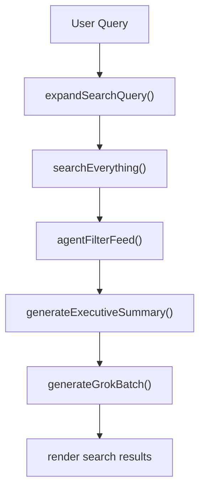
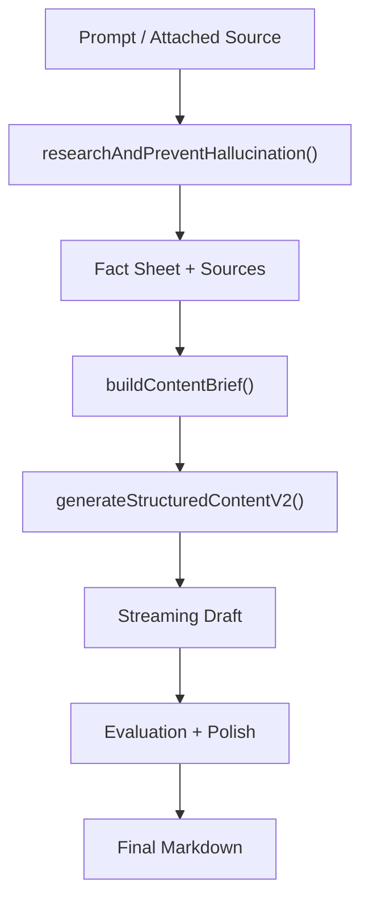
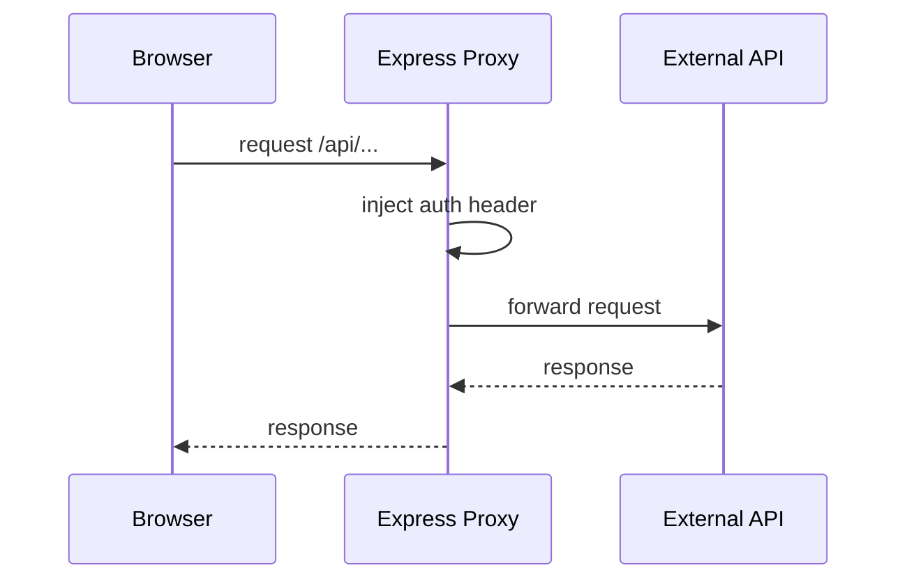

# Foro: Developer Architecture Guide

เอกสารนี้เป็นฉบับหน้าเดียวสำหรับเอาไปวางใน VitePress ได้ทันที โดยออกแบบให้ dev เปิดแล้วเข้าใจระบบเร็ว ไล่โค้ดตามง่าย และใช้เป็นจุดเริ่มต้นสำหรับ debug หรือ handoff งานต่อได้

## ระบบนี้คืออะไร

Foro คือ React web app ที่ทำ 3 อย่างหลักในระบบเดียว:

- ดึง feed และค้นหาข้อมูลจาก X
- ใช้ AI เพื่อคัดกรอง แปล สรุป และจัดระเบียบข้อมูล
- ใช้ AI pipeline เพื่อสร้างคอนเทนต์ภาษาไทยจากข้อมูลที่ผ่านการ research แล้ว

ในเชิงสถาปัตยกรรม ระบบนี้เป็น:

- Frontend: React + Vite
- Proxy backend: Express
- External services: Twitter API, xAI/Grok, Tavily
- Persistence: `localStorage`

## ถ้าจะอ่านโค้ด เริ่มจากตรงไหน

ถ้าเพิ่งเข้ามาในโปรเจกต์และอยากเข้าใจเร็วที่สุด ให้อ่านตามลำดับนี้:

1. `src/main.jsx`
2. `src/App.jsx`
3. `src/services/TwitterService.js`
4. `src/services/GrokService.js`
5. `src/components/CreateContent.jsx`
6. `server.cjs`

mental model แบบสั้นที่สุดคือ:

```text
App.jsx เป็นตัวคุม flow หลัก
  -> เรียก service layer
  -> service คุยกับ proxy
  -> proxy คุยกับ third-party APIs
  -> ผลลัพธ์กลับเข้า state + localStorage
  -> UI render ออกมา
```

## ภาพรวมสถาปัตยกรรม



## โครงสร้างของระบบ

### Frontend

entry point ของแอปคือ `src/main.jsx` และ root controller อยู่ที่ `src/App.jsx`

`App.jsx` รับผิดชอบ:

- ถือ state หลักของระบบ
- เปลี่ยน view ตามเมนู
- orchestrate แต่ละ feature
- เรียก service layer
- sync ข้อมูลบางส่วนลง `localStorage`

component สำคัญ:

- `src/components/Sidebar.jsx`
- `src/components/RightSidebar.jsx`
- `src/components/FeedCard.jsx`
- `src/components/CreateContent.jsx`

### Service Layer

- `src/services/TwitterService.js`
  หน้าที่: ดึง user info, home feed, search และ thread context

- `src/services/GrokService.js`
  หน้าที่: สรุปข่าว, แปล, คัดกรอง feed, ขยาย query, research, fact sheet และสร้างคอนเทนต์

- `src/utils/markdown.js`
  หน้าที่: แปลง markdown เป็น HTML และ sanitize ก่อน render

### Proxy Layer

`server.cjs` เป็น backend บาง ๆ สำหรับ:

- `/api/twitter/*`
- `/api/xai/*`
- `/api/tavily/search`

หน้าที่หลักคือซ่อน API keys, แก้ CORS และทำตัวเป็น integration boundary ของระบบ

## มุมมอง state ของระบบ

ระบบนี้ไม่ได้ใช้ Redux หรือ state library ภายนอก แต่ใช้ React hooks เป็นหลัก

state สำคัญอยู่ใน `App.jsx` เช่น:

- `watchlist`
- `feed`
- `originalFeed`
- `searchResults`
- `originalSearchResults`
- `bookmarks`
- `readArchive`
- `postLists`
- `activeView`
- `createContentSource`

ควรเข้าใจให้ชัดว่า:

- `originalFeed` คือ source of truth ของ feed
- `feed` คือ derived state สำหรับแสดงผล
- search state แยกจาก home feed
- bookmark และ read archive เก็บใน client-side persistence

## View หลักในระบบ

แอปนี้ใช้หน้าเดียวแล้วสลับ view ตาม `activeView`

view หลักที่มี:

- `home`
- `content`
- `read`
- `audience`
- `bookmarks`
- `search`

ข้อดีคือ flow ตรงและอ่านง่าย แต่ข้อเสียคือ `App.jsx` รับผิดชอบหลายอย่างมาก

## Feature 1: Home Feed

เป้าหมายของ feature นี้คือดึงโพสต์ล่าสุดจาก watchlist หรือ post list แล้วแสดงผลแบบอ่านง่ายสำหรับผู้ใช้ไทย

### flow



### สิ่งที่เกิดขึ้นจริง

1. ผู้ใช้เลือกกลุ่ม account ที่ต้องการติดตาม
2. `handleSync()` ใน `App.jsx` เรียก `fetchWatchlistFeed()`
3. `TwitterService` สร้าง query แบบ `from:user1 OR from:user2 ...`
4. request ผ่าน proxy ไปยัง Twitter API
5. ผลลัพธ์ถูก normalize ให้ shape ของข้อมูลสม่ำเสมอ
6. ระบบแบ่งโพสต์เป็น chunk
7. chunk ที่ยังไม่มี summary ภาษาไทยจะถูกส่งไป `generateGrokBatch()`
8. summary ถูก merge กลับเข้า `originalFeed`
9. `feed` ถูก derive ตาม list หรือ view ที่กำลังเปิดอยู่

### จุดสำคัญที่ dev ควรรู้

- ระบบใช้ progressive translation ไม่รอครบทั้งก้อน
- ข้อมูล feed ใหม่ถูกเก็บลง `localStorage`
- มี sanitize logic สำหรับข้อมูลเก่าที่ summary ไม่สมบูรณ์

## Feature 2: Search และ AI Filter

search ในระบบนี้ไม่ใช่แค่ยิง query ตรงไป X แต่มี AI เข้ามาช่วยหลายขั้น

### flow



### สิ่งที่เกิดขึ้นจริง

1. ผู้ใช้กรอกคำค้น
2. `expandSearchQuery()` ช่วยขยาย query ให้ครอบคลุมขึ้น
3. `searchEverything()` เรียก Twitter search ผ่าน proxy
4. `agentFilterFeed()` ใช้ AI กรองโพสต์ที่ไม่เกี่ยวข้องหรือคุณภาพต่ำ
5. `generateExecutiveSummary()` สรุปภาพรวมผลค้นหา
6. `generateGrokBatch()` แปลหรือสรุปโพสต์แต่ละตัวเป็นภาษาไทย
7. UI แสดงผลแบบ progressive

### AI Filter ใน feed

นอกจาก search แล้ว ผู้ใช้ยังกรอง feed ด้วย prompt เช่น “ข่าว AI”, “Layer 2”, “ข่าวการเมือง” ได้

flow คือ:

1. ส่ง feed ปัจจุบัน + prompt ไป `agentFilterFeed()`
2. AI คืนรายการ `id` ของโพสต์ที่ผ่านเงื่อนไข
3. frontend filter feed ตาม `id` ที่ได้มา

## Feature 3: Audience Discovery

feature นี้ช่วยหา account ที่ควรติดตาม

มี 2 โหมด:

- AI recommendation
- manual search

### AI recommendation flow

1. ผู้ใช้ระบุหัวข้อที่สนใจ
2. `discoverTopExperts(query, exclude)` สร้างรายชื่อ expert candidate
3. UI แสดงรายการแนะนำ
4. เมื่อผู้ใช้กดเพิ่ม ระบบเรียก `getUserInfo(username)` เพื่อ verify ตัวตนจาก API จริงก่อนเพิ่มเข้า watchlist

### แนวคิดสำคัญ

- AI เป็นแค่ recommender
- Twitter API เป็นตัว confirm identity
- frontend ป้องกัน duplicate ก่อนบันทึก

## Feature 4: Post Lists

Post List คือการจัดกลุ่ม account ที่ติดตาม เช่น AI, Crypto, Politics

### ใช้ทำอะไร

- ช่วย filter feed ตาม theme
- แยก source ตาม use case
- ทำให้ผู้ใช้สลับ context ได้เร็ว

### logic หลัก

- แต่ละ list มี `id`, `name`, `color`, `members`
- เมื่อเลือก list ระบบจะ filter `originalFeed` ตาม `members`
- ไม่ได้สร้างฐานข้อมูล feed แยก แต่ใช้ in-memory filtering

## Feature 5: Read Archive

Read Archive เป็นคลังเก็บโพสต์หรือข่าวที่เคย sync เข้ามาแล้ว

### แนวคิด

- รายการใหม่จาก feed จะถูก append เข้า archive
- ผู้ใช้ sort ตามยอดวิวหรือ engagement ได้
- ใช้ `FeedCard` ซ้ำกับหน้าอื่นเพื่อลดความซ้ำซ้อนของ UI

## Feature 6: Bookmarks

Bookmarks เก็บได้ทั้ง:

- news posts
- generated articles

### สิ่งที่สำคัญ

- ไม่ได้เก็บเฉพาะโพสต์จาก X
- บทความ AI ก็ถูกเก็บใน storage เดียวกัน
- หน้า bookmarks แยกการแสดงผลตาม `type`

## Feature 7: AI Content Generation

นี่คือ pipeline ที่ซับซ้อนที่สุดในระบบ

เป้าหมายคือสร้างคอนเทนต์ภาษาไทยจากข้อมูลที่ research แล้ว โดยลด hallucination ให้มากที่สุด

### flow หลัก



### Stage 1: Research

ใช้ `researchAndPreventHallucination()`

สิ่งที่ฟังก์ชันนี้ทำ:

- derive research query
- ค้นข้อมูลจาก Tavily
- ค้น evidence จาก X ทั้ง top และ latest
- รวมข้อมูลเป็น fact sheet
- คืน sources ที่ใช้อ้างอิง

นี่คือชั้นสำคัญที่สุดในการลด hallucination

### Stage 2: Brief

ใช้ `buildContentBrief()`

หน้าที่:

- กำหนด main angle
- ระบุ audience
- ระบุ must-have facts
- ระบุ caveats
- วาง structure ของเนื้อหา

brief นี้ช่วยให้ writer model เขียนตรงขึ้น ไม่หลุดประเด็นง่าย

### Stage 3: Draft

ใช้ `generateStructuredContentV2()`

หน้าที่:

- สร้าง draft จาก fact sheet + brief
- stream กลับมาแบบ realtime
- รองรับหลาย format เช่น social post, short video script, blog, thread

### Stage 4: Evaluation และ Polish

หลัง draft เสร็จ ระบบจะตรวจอีกชั้นว่า:

- ยึด fact sheet จริงไหม
- tone ตรงไหม
- ภาษาไทยลื่นไหม
- มี engagement bait หรือ hype เกินจริงไหม

จากนั้นค่อยคืน final markdown ให้ UI

## Markdown Rendering

บทความหรือผลลัพธ์ AI ถูก render ผ่าน `src/utils/markdown.js`

flow:

1. รับ markdown
2. แปลงเป็น HTML ด้วย `marked`
3. sanitize ด้วย `DOMPurify`
4. render ด้วย `dangerouslySetInnerHTML`

เหตุผลที่ต้องทำแบบนี้ เพราะระบบรับ content จาก AI โดยตรง จึงต้อง sanitize ก่อนแสดงเสมอ

## Proxy และ External API Integration

`server.cjs` เป็น integration boundary ของระบบ

### route ที่มีจริง

- `/api/twitter/*` -> `https://api.twitterapi.io`
- `/api/xai/*` -> `https://api.x.ai`
- `/api/tavily/search` -> `https://api.tavily.com/search`

### flow



### ทำไมต้องมี proxy

- ซ่อน API keys
- ลดปัญหา CORS
- ทำให้ frontend ไม่ต้องคุยกับ third-party โดยตรง
- รวม integration ไว้ที่จุดเดียว

## localStorage ที่ใช้จริง

ตัวอย่าง key หลักในระบบ:

- `foro_watchlist_v2`
- `foro_home_feed_v1`
- `foro_postlists_v2`
- `foro_bookmarks_v1`
- `foro_read_archive_v1`
- `foro_attached_source_v1`
- `foro_gen_input_v1`
- `foro_gen_length_v1`
- `foro_gen_tone_v1`
- `foro_gen_format_v1`
- `foro_gen_factsheet_v1`
- `foro_gen_sources_v1`
- `foro_gen_markdown_v1`

## ถ้าจะ debug ให้ดูตรงไหนก่อน

### Feed ไม่ขึ้น

ดู:

- `src/App.jsx`
- `src/services/TwitterService.js`
- `server.cjs`

ฟังก์ชันสำคัญ:

- `handleSync()`
- `fetchWatchlistFeed()`

### Search เพี้ยนหรือผลไม่ดี

ดู:

- `src/App.jsx`
- `src/services/GrokService.js`
- `src/services/TwitterService.js`

ฟังก์ชันสำคัญ:

- `handleSearch()`
- `expandSearchQuery()`
- `searchEverything()`
- `agentFilterFeed()`
- `generateExecutiveSummary()`

### AI สร้างคอนเทนต์ไม่ตรง

ดู:

- `src/components/CreateContent.jsx`
- `src/services/GrokService.js`

ฟังก์ชันสำคัญ:

- `handleGenerate()`
- `researchAndPreventHallucination()`
- `buildContentBrief()`
- `generateStructuredContentV2()`

## จุดแข็งของ architecture ปัจจุบัน

- พัฒนาเร็ว
- feature ครบใน frontend เดียว
- AI pipeline ของ content generation ค่อนข้างแข็งแรง
- progressive loading และ streaming ทำให้ UX ดี
- proxy layer ชัดเจน

## ข้อจำกัดที่ควรรู้

- `src/App.jsx` ใหญ่มากและเป็นศูนย์รวมหลาย domain
- state หลักกระจุกใน component เดียว
- persistence ยังเป็น local-only
- proxy ยังไม่มี logging/metrics/retry ที่จริงจัง

## ถ้าจะ refactor ระยะต่อไป

แนะนำลำดับนี้:

1. แยก `App.jsx` เป็น feature containers
2. ย้าย state domain ออกเป็น custom hooks
3. แยก backend API layer ให้มี domain endpoint ของระบบเอง
4. เพิ่ม database สำหรับ bookmark, watchlist, list และ generated article

## สรุปสั้นสำหรับ dev

ถ้าจะเข้าใจระบบนี้ให้เร็ว ให้จำไว้แบบนี้:

- `App.jsx` คือตัวคุม flow หลัก
- `TwitterService.js` คือชั้นดึงข้อมูลจาก X
- `GrokService.js` คือหัวใจของ AI ทั้งระบบ
- `CreateContent.jsx` คือจุดรวมของ AI writer flow
- `server.cjs` คือ boundary ไป external APIs

และถ้าจะไล่ปัญหา ให้ไล่จาก UI -> service -> proxy -> upstream ตามลำดับเสมอ
